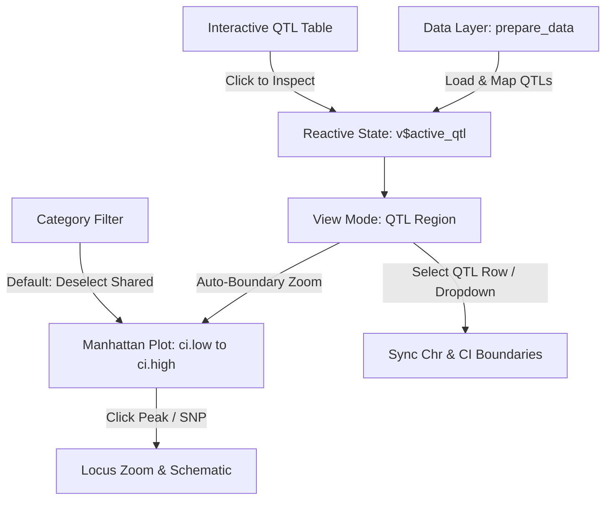

# QTL Analysis Updates to App

This is based on analysis reported in the (currently private) repo
[https://github.com/AttieLab-Systems-Genetics/Vanderbilt](https://github.com/AttieLab-Systems-Genetics/Vanderbilt/tree/main/results).

## Prompts

* Develop implementation plan for QTL features and modifications to the app described below. Implement upon agreement.
* Develop a plan to incorporate `SHINY_APP/QTLresults` more fully into the app. Implement plan upon agreement. Details include:
  * Toggle between showing "Select F2 Glycemic QTL" and "Search Gene Symbol" based on whether "View Mode" is "QTL Region" or something else.
  * Modify as needed throughout app to find `Top_glycemic_QTL_for_sex_additive_analysis.csv` now in `QTLresults` folder.
  * Consider how to show this CSV file in main panel. For instance, having Select F2 Glycemic QTL" be blank as default for "View Mode: QTL Region" and then show the table in the main panel before a selection is made, hiding the table once selection is made. This would obviate the need for `QTLs` button in upper right.
  * Have way to reset selected peak for "QTL Region" to none; also, should reset to none when change QTL Region.
  * Optionally add scan for trait using PNGs in `QTLresults` folder. Traits beginning with "AUC" would use the *auc*png`files, with others using *traj*png` files. Pick file based on `Chr` for trait. Put this plot above the Peak Score plot, but have checkbox to "Hide Scan".  

## New QTL Features and Modifications

New feature: integrate loci identified in the F2 study, as listed in
`Top_glycemic_QTL_for_sex_additive_analysis.csv`.

We want to show this table and connect these QTL regions to other features.
For example, to zoom into the QTL on Chr16, I select view mode=chromosome, select chromosome=11, and then use the zoom tool for ~50 to 100Mbp. I then click on one of the triangles to highlight, yielding this view, where three genes are DE, all going up in the SJL backcrossed mice and proximal to a MAFA peak with SNPs.

Jumping from this locus on Chr16 to our QTL on 13, requires select chromosome 13 and then zoom for ~0 to 50Mbp, yielding this after clicking on a orange diamond (coding variant).

Since this type of query will be the focus on the app when integrating the QTL from the F2s, what would it take to include the QTL as another option for view mode? We could offer Chr and the corresponding CI for low and high as boundaries that will be displayed.

Finally, deselect “Shared” from the visible categories as the default.

---

## Implementation Plan: F2 Glycemic QTL Integration & Navigation Enhancement

This plan outlines the architecture, data structures, reactive flow, and visual enhancements required to integrate the F2 glycemic QTL data into the **MafA Discovery** Shiny application.



---

### 1. Architectural Summary & Requirements

| Requirement | Current State | Proposed Solution |
| :--- | :--- | :--- |
| **QTL Dataset Integration** | `Top_glycemic_QTL_for_sex_additive_analysis.csv` exists in `SHINY_APP/QTLresults/` but is not loaded. | Load and standardize QTL dataset in `prepare_data()`, computing global genome-wide offsets and human-readable identifiers. |
| **"QTL Region" View Mode** | View modes only include *Genome-Wide*, *Chromosome*, and dynamic *Locus Zoom*. | Add `"QTL Region"` to `View Mode` options (`Genome-Wide`, `Chromosome`, `QTL Region`, `Locus Zoom`). |
| **QTL Navigation & Auto-Bounding** | User must manually select chromosome and use Plotly box-zoom tool to find coordinates (e.g. 50–100 Mb on Chr16 or 0–50 Mb on Chr13). | In `"QTL Region"` mode, selecting a QTL automatically bounds the Manhattan x-axis to `[ci.low, ci.high]` (in Mbp) with 3% margin. |
| **Interactive QTL Table** | No visual table of QTLs. | Add a collapsible panel or dedicated tab/modal displaying the complete F2 QTL table with interactive row selection. |
| **Visual QTL Cue on Manhattan Plot** | Manhattan plot only displays ChIP peaks and coding SNPs. | Render a shaded region or top highlight banner for the active QTL confidence interval (`ci.low` to `ci.high`) and a vertical dashed marker for peak position (`pos`). |
| **Default Category Filtering** | All categories (`Shared`, `C57_Specific`, `SJL_Specific`, `Discordant`) displayed, overwhelming strain differences. | Provide category filter with `"Shared"` **deselected by default**, highlighting strain-divergent peaks (`C57_Specific`, `SJL_Specific`, `Discordant`) immediately upon load. |

---

### 2. Data Layer Specifications (`prepare_data()`)

In [`SHINY_APP/app.R`](../SHINY_APP/app.R):

1. **Load CSV**:

   ```r
   qtls <- fread("QTLresults/Top_glycemic_QTL_for_sex_additive_analysis.csv")
   ```

2. **Standardize Coordinates & Identifiers**:
   * Standardize chromosome naming: `qtls[, Chr := paste0("Chr", Chr)]`.
   * Ensure numeric conversions: `pos`, `ci.low`, `ci.high`, `lod`, `BB_effect`, `BS_effect`, `SS_effect`.
   * Create display label for selector:

     ```r
     qtls[, qtl_id := paste0(trait, " @ ", Chr, ":", round(pos, 1), " Mb (LOD ", round(lod, 1), ")")]
     ```

   * Calculate global Manhattan positions using `chr_map`:

     ```r
     qtls[chr_map, on = "Chr", `:=`(
       GlobalPos_Mbp     = pos + i.Offset_Mbp,
       GlobalCI_Low_Mbp  = ci.low + i.Offset_Mbp,
       GlobalCI_High_Mbp = ci.high + i.Offset_Mbp
     )]
     ```

3. Return `qtls` in the data bundle list alongside `degs`, `mafa`, `genes`, `chr_map`, `snps`.

---

### 3. UI Modifications

#### 3.1 Dynamic Sidebar Controls

* **View Mode Selector**:

  ```r
  selectInput("zoom_mode", "View Mode:", choices = c("Genome-Wide", "Chromosome", "QTL Region"))
  ```

* **Conditional QTL Selector (`output$qtl_selector_ui`)**:
  Renders when `input$zoom_mode == "QTL Region"`:

  ```r
  selectInput("sel_qtl", "Select F2 Glycemic QTL:", 
              choices = d$qtls$qtl_id, 
              selected = v$active_qtl$qtl_id)
  ```

* **Visible Categories Control**:
  Re-introduce `checkboxGroupInput("show_cat", "Visible Categories:", ...)` with `"Shared"` deselected by default:

  ```r
  checkboxGroupInput("show_cat", "Visible Categories:", 
                     choices = c("Shared", "C57_Specific", "SJL_Specific", "Discordant"),
                     selected = c("C57_Specific", "SJL_Specific", "Discordant"))
  ```

  *(Users can re-enable "Shared" anytime with a single click).*

#### 3.2 Interactive QTL Explorer Table

* In `"QTL Region"` mode, displaying table with columns:
  `Trait`, `Chr`, `Peak (Mbp)`, `95% CI (Mbp)`, `LOD`, `Additive Effects (BB, BS, SS)`.
* Selecting any row in this table sets the active QTL and switches view to the confidence interval.

---

### 4. Reactive State & Server Architecture

1. **Reactive State in `v`**:
   * `v$active_qtl`: Holds current QTL record (defaults to the top QTL, e.g., Chr16 AUC_of_AUCs LOD 5.07 or first entry).
   * `v$current_chr`: Synced to `v$active_qtl$Chr` whenever a QTL is selected.
   * `v$active_pk`: Holds selected MafA peak. If in `"QTL Region"` mode and no peak is selected, auto-select the highest peak within the QTL interval for seamless schematic preview.

2. **QTL Selection Observer (`input$sel_qtl`)**:

   ```r
   observeEvent(input$sel_qtl, {
     req(input$sel_qtl)
     q_row <- d$qtls[qtl_id == input$sel_qtl]
     if (nrow(q_row) > 0) {
       v$active_qtl   <- q_row[1]
       v$current_chr  <- q_row$Chr[1]
       v$user_zoom    <- NULL
       
       local_pks <- d$mafa[Chr == q_row$Chr[1] & Mid >= q_row$ci.low * 1e6 & Mid <= q_row$ci.high * 1e6]
       if (nrow(local_pks) > 0) {
         v$active_pk <- local_pks[which.max(`Peak Score`)]
       }
     }
   })
   ```

3. **Coordinate Window Calculation in `output$manhattan`**:
   When `input$zoom_mode == "QTL Region"`:

   ```r
   req(v$active_qtl)
   q <- v$active_qtl
   chr_offset <- d$chr_map[Chr == q$Chr, Offset_Mbp]
   
   ci_span <- q$ci.high - q$ci.low
   pad <- ci_span * 0.03
   x_range <- if (!is.null(v$user_zoom)) {
     v$user_zoom
   } else {
     c(chr_offset + q$ci.low - pad, chr_offset + q$ci.high + pad)
   }
   ```

4. **Visual QTL Annotations on Manhattan Plot**:
   * In `"QTL Region"` and `"Chromosome"` modes, draw:
     * Shaded rectangular background across `[q$GlobalCI_Low_Mbp, q$GlobalCI_High_Mbp]`.
     * Vertical dashed marker at the QTL peak position.

---

### 5. Detailed Step-by-Step Implementation Sequence

1. **Step 1: Load and Process QTL Data** (Completed):
   * Updated `prepare_data()` to ingest `Top_glycemic_QTL_for_sex_additive_analysis.csv` and calculate linear global coordinates (`GlobalPos_Mbp`, `GlobalCI_Low_Mbp`, `GlobalCI_High_Mbp`).
2. **Step 2: Add Category Filter with Default Deselect "Shared"** (Completed):
   * Re-introduced `checkboxGroupInput("show_cat", ...)` in the sidebar with `selected = c("C57_Specific", "SJL_Specific", "Discordant")` (Shared deselected by default).
   * Wired `filtered_peaks`, `schematic`, and `metadata_panel` to respect `input$show_cat`.
3. **Step 3: Implement "QTL Region" View Mode** (Completed):
   * Expanded `selectInput("zoom_mode", ...)` options to include `"QTL Region"`.
   * Added dynamic `output$qtl_selector_ui` for QTL dropdown selection.
   * Wired x-axis boundaries to `[ci.low, ci.high]` of the active QTL with local Mbp coordinate ticks.
4. **Step 4: Annotate Manhattan Plot with QTL Interval** (Completed):
   * Rendered interval highlight (translucent blue rectangle) and peak position marker (dashed line) for the active QTL.
   * Formatted local Mbp tick marks within the QTL confidence interval.
5. **Step 5: Add F2 QTL Table Modal / Viewer** (Completed):
   * Added quick-reference table modal (`input$show_qtl_table`) displaying all 11 QTL loci with quick-zoom action.
6. **Step 6: Update Documentation & Verification** (Completed):
   * Updated [`DEVELOPER.md`](../DEVELOPER.md) architecture and reactive lifecycle.

---

## 6. Results of Implementation

All features requested in Mark's notes have been implemented in [`SHINY_APP/app.R`](../SHINY_APP/app.R) and documented in [`DEVELOPER.md`](../DEVELOPER.md).

### 6.1 Implemented Features Summary

| Feature | Implementation Details | User Impact |
| :--- | :--- | :--- |
| **F2 QTL Data Ingestion** | In `prepare_data()`, loads `QTLresults/Top_glycemic_QTL_for_sex_additive_analysis.csv`. Pre-calculates `GlobalPos_Mbp`, `GlobalCI_Low_Mbp`, `GlobalCI_High_Mbp` using Ensembl GRCm39 `chr_map`. | All 11 glycemic QTL loci across chromosomes 2, 3, 7, 11, 13, 16 are available at session start with zero Bioconductor runtime dependencies. |
| **"QTL Region" View Mode** | Added `"QTL Region"` to `selectInput("zoom_mode", ...)` alongside `Genome-Wide`, `Chromosome`, and dynamic `Locus Zoom`. | Provides dedicated, one-click access to QTL intervals without requiring manual box-zooming. |
| **Automated CI Bounding** | Automatically sets Manhattan x-axis boundaries to `[ci.low, ci.high]` (in Mbp) + 3% margin. Local coordinate ticks and labels dynamically compute round Mbp breaks. | Eliminates manual navigation: selecting a Chr16 QTL immediately frames 50.87–96.88 Mb; selecting a Chr13 QTL frames 3.61–47.86 Mb. |
| **Visual Interval Cues** | Translucent blue rectangular banner across `[ci.low, ci.high]` and blue dashed line at the QTL peak position. | Active QTL interval is instantly recognizable on both *QTL Region* and *Chromosome* views. |
| **Interactive QTL Reference Table** | Interactive table displaying all 11 QTLs with markers, LOD scores, CIs, and additive effect estimates (`BB`, `BS`, `SS`). | Quick inspection directly in panel. |
| **Default Category Filter ("Shared" Deselected)** | Re-introduced `checkboxGroupInput("show_cat", "Visible Categories:", ...)` with default `selected = c("C57_Specific", "SJL_Specific", "Discordant")`. | Strain-divergent peaks and variants stand out immediately on launch without being drowned out by thousands of shared non-divergent points. "Shared" can be re-enabled with one click. |
| **Peak-to-QTL Metadata Badge** | When a MafA peak resides within the active QTL confidence interval, the metadata panel renders a prominent highlight card (`Within F2 QTL: [trait] (LOD [lod])`). | Directly connects molecular binding peaks to organismal glycemic traits. |

---

## 7. Full `QTLresults` Integration & In-Panel Exploration

The application incorporates `SHINY_APP/QTLresults` as a first-class feature of the explorer.

### 7.1 Key Enhancements

1. **Data Organization in `QTLresults/`**:
   * `Top_glycemic_QTL_for_sex_additive_analysis.csv` is resolved from `QTLresults/` with fallbacks for local and Shiny server deployments.
   * Resource path `QTLresults` is registered to cleanly serve static scan PNGs.
2. **Dynamic Top Navigation Toggle**:
   * When **View Mode** is `"QTL Region"`, the primary input slot displays **"Select F2 Glycemic QTL"**.
   * In `"Genome-Wide"` or `"Chromosome"` view, the slot displays **"Search Gene Symbol"**.
3. **In-Panel Interactive QTL Overview Table & Key Loci Scans**:
   * In `"QTL Region"` mode, the default selection is blank (`""`).
   * While blank, the overview panel is organized into two distinct sections:
     * **AUC Glycemic Traits**: Renders `QTLresults/scan_auc_sex_additive_key_loci.png` followed by the interactive table of `AUC_gluc_*` trait peaks (`AUC_gluc_4wk`, `AUC_gluc_5wk`, `AUC_gluc_6wk`, `AUC_gluc_8wk`).
     * **Trajectory & Rate Glycemic Traits**: Renders `QTLresults/scan_traj_sex_additive_key_loci.png` followed by the trajectory and rate trait table (`Slope_AUCs`, `AUC_8wk_minus_AUC_4wk`, and `AUC_of_AUCs`).
   * **Key Loci Plot Toggles**: Two independent checkboxes at the top right of the panel (**"Hide AUC Key Loci Scan"** and **"Hide Trajectory Key Loci Scan"**) let users selectively suppress either or both summary plots to reduce vertical scrolling.
   * Both tables provide trait names, markers, chromosomes, peak positions, 95% CIs, LOD scores, additive effects ($BB$, $BS$, $SS$), and an **"Inspect QTL →"** button.
   * Clicking **"Inspect QTL →"** (or selecting a QTL from the top dropdown) hides the overview panel, frames the QTL confidence interval on the Manhattan plot, and activates the chromosome-specific trait scan.
   * A **"← Back to QTL Overview Table"** action link returns to the overview anytime.
4. **Peak Selection & Reset Mechanics**:
   * Entering `"QTL Region"` or changing QTL selection resets the active peak (`v$active_pk <- NULL`).
   * An explicit **"✕ Deselect Peak"** button appears in the navbar and schematic sidebar whenever a peak is active in view modes other than *Locus Zoom*, allowing quick return to an unselected state.
5. **Additive QTL Trait Scan PNGs**:
   * Active QTLs display their corresponding additive scan plot from `QTLresults/` directly above the Manhattan plot:
     * Traits starting with `"AUC_gluc"` map to `scan_chr<Chr>_auc_sex_additive.png`.
     * Trajectory and compound traits (`Slope_AUCs`, `AUC_8wk_minus_AUC_4wk`, `AUC_of_AUCs`) map to `scan_chr<Chr>_traj_sex_additive.png`.
   * A **"Hide QTL Scan Plot"** checkbox in the Manhattan controls allows toggling scan visibility.
6. **Continuous Right-Hand Control Card Stacking**:
   * Plots (Scan plot, Manhattan plot, and Locus Schematic) are housed in a 9-column left canvas.
   * Both control panels (**Manhattan Controls** and **Locus Schematic Controls**) are organized in a single continuous 3-column right sidebar. This ensures the schematic controls always follow immediately below the Manhattan controls, eliminating artificial vertical whitespace regardless of whether the QTL scan plot is visible.
