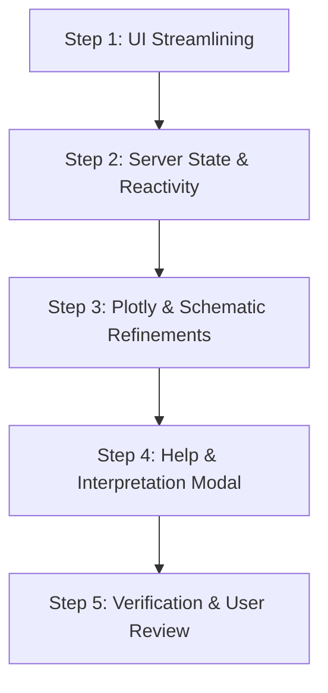

# Redesign of App

## Prompts

### Ideas to improve reactivity and navigation

* Hide "Select Chromosome:" when in "View Mode: Genome-Wide"
* "View Mode: Locus Zoom"
  * If "Search Gene Symbol:" is empty, main panel is blank.
  * Don't show "Locus Zoom" option until Gene Symbol is non-empty.
  * Once a "Gene Symbol" is selected, it appears.
  * If you then deselect "Search Gene Symbol", revert to whole genome and remove "Locus Zoom" from "View Mode".
* "Locus Window (Kbp):" this is only relevant when in "Locus Zoom"
  * Might be useful to have only selected set of values, say 20,50,100,200,500,1000,2000
* Top main panel initially has whole genome. When you "Select Gene Symbol":
  * "View Mode:" switches to "Locus Zoom"
  * X axis named as "Chromosome" with no Mbp ticks.
  * Want to be able to switch from "Locus Zoom" to "Chromosome" to the right chromosome easily.
* "Visible Categories:" is redundant given plotly ability to click on labels.
* "Min Peak Score:" consider selected values as for "Locus Window".

### Challenges with Interpreting

* Need explanation of both panels on "Locus Zoom".
  * This could be pop-up or pull-down.
  * Is top panel a subset of the "Chromosome" image?
* Reactive hiding and showing of side panel would simplify presentation
(see ideas above).

### Further Improvements

* Organize `{shinyapp,publishapp,redesign,qtlanalysis}.md` as a `Developer Guide` to be published via `docs/`.
* Fix `Reset` on app to reset everything, including selected gene.
* Move `Reset` and `Developer Guide` (new)buttons to below "Min phastCons Score:" slider.
* Detailed "Peak" information now on sidebar should go below last figure on main panel.

---

## Implementation Plan: MafA Discovery Shiny App Redesign

This plan addresses all items outlined in `Prompts` section of
[`redesign.md`](redesign.md#prompts)
to streamline UI reactivity, simplify navigation, eliminate redundant controls, and clarify multi-panel interpretation.

### 1. Architectural Summary & Objectives

| Objective | Current Behavior | Proposed Solution |
| :--- | :--- | :--- |
| **Chromosome Selector Visibility** | Always rendered in sidebar even in *Genome-Wide* mode. | Conditionally display `sel_chr` only when in *Chromosome* view mode. |
| **"Locus Zoom" Mode Availability** | Always available in dropdown, leading to empty/confusing plots if no gene/peak is selected. | Dynamically offer `"Locus Zoom"` only after a gene is searched or peak is clicked. |
| **Search Gene Symbol Deselection** | Clearing the search box left "Locus Zoom" active and could retain stale selection. | Automatically revert to whole genome (`Genome-Wide`), clear active peak/SNPs, and remove `"Locus Zoom"` from `View Mode`. |
| **Locus Window (kb) Control** | Free-form `numericInput` always visible in sidebar. | Show only during *Locus Zoom*; convert to discrete selection (`20, 50, 100, 200, 500, 1000, 2000` kb). |
| **Locus Zoom $\leftrightarrow$ Chromosome Transition** | Selecting a gene sets peak but does not update `sel_chr`, causing switching to *Chromosome* to reset to Chr1. | Sync `sel_chr` to match `v$active_pk$Chr` whenever a gene is selected or a peak is clicked. |
| **Top Panel in Locus Zoom** | 1 Mbp window with global axis label "Chromosome" and no tick marks. | Clarify coordinate scale with local Mbp ticks (`Chr X (Mbp)`), or show Chromosome context with active peak highlighted. |
| **Redundant "Visible Categories"** | Bulky `checkboxGroupInput` duplicates Plotly's native interactive legend filtering. | Remove `show_cat` from sidebar; rely on Plotly's interactive legend filtering and render all categories in schematic. |
| **Min Peak Score** | Continuous slider (`0`–`10,000`). | Convert to discrete selections (`0, 100, 200, 500, 1000, 2000, 5000`) for cleaner filtering. |
| **Interpretation & Visual Guidance** | No in-app explanation of the relationship between top and bottom panels. | Add an interactive "How to Interpret" popover/modal explaining the macro-micro relationship between panels. |

---

### 2. Detailed Technical Specifications

#### 2.1 Conditional Chromosome Selector

* Wrap the chromosome selector in a conditional UI or render conditionally:

  ```r
  output$chr_selector_ui <- renderUI({
    req(input$zoom_mode == "Chromosome")
    selectInput("sel_chr", "Select Chromosome:", choices = d$chr_map$Chr, selected = v$current_chr)
  })
  ```

* Result: Chromosome selector is automatically hidden in *Genome-Wide* and *Locus Zoom* modes.

#### 2.2 Dynamic "View Mode" Lifecycle

* Initial state:

  ```r
  zoom_choices <- c("Genome-Wide", "Chromosome")
  ```

* When a gene symbol is selected (`input$search_gene != ""`):
  * Identify target gene and closest MafA binding peak.
  * Set `v$active_pk` and `v$last_gene <- input$search_gene`.
  * Update `v$current_chr <- gene_row$Chr[1]`.
  * Expand choices: `updateSelectInput(session, "zoom_mode", choices = c("Genome-Wide", "Chromosome", "Locus Zoom"), selected = "Locus Zoom")`.

* When `input$search_gene` is blanked out / deselected:
  * Revert to whole genome view (`selected = "Genome-Wide"`).
  * Remove `"Locus Zoom"` from `zoom_mode` choices (`choices = c("Genome-Wide", "Chromosome")`).
  * Reset `v$active_pk <- NULL`, `v$active_snp <- NULL`, `v$last_gene <- NULL`, `v$user_zoom <- NULL`.
  * Trigger Plotly layout revision to refresh genome-wide coordinates.
* When **↺ Reset to Genome-Wide** is clicked:
  * Reset `v$active_pk <- NULL`, `v$active_snp <- NULL`, `v$last_gene <- NULL`.
  * Reset `search_gene` to `""`.
  * Reset `zoom_mode` choices back to `c("Genome-Wide", "Chromosome")` with `selected = "Genome-Wide"`.

#### 2.3 Seamless Chromosome $\leftrightarrow$ Locus Zoom Linking

* When a gene or peak is selected on chromosome $K$:
  * Automatically update the chromosome tracking value (`v$current_chr <- pk$Chr`).
  * If the user changes `View Mode` to `"Chromosome"`, it automatically centers on chromosome $K$ rather than defaulting to `Chr1`.

---

### 3. Discrete Filter Controls

#### 3.1 Discrete Locus Window (`win_kb`)

* Conditionally render only when `input$zoom_mode == "Locus Zoom"`:

  ```r
  output$locus_window_ui <- renderUI({
    req(input$zoom_mode == "Locus Zoom")
    selectInput("win_kb", "Locus Window:", 
                choices = c("20 kb" = 20, "50 kb" = 50, "100 kb" = 100, 
                            "200 kb" = 200, "500 kb" = 500, "1,000 kb (1 Mb)" = 1000, 
                            "2,000 kb (2 Mb)" = 2000), 
                selected = 500)
  })
  ```

#### 3.2 Discrete Min Peak Score (`min_score`)

* Replace the continuous 0–10,000 slider with discrete thresholds:

  ```r
  selectInput("min_score", "Min Peak Score:",
              choices = c("All (0)" = 0, "100" = 100, "200" = 200, 
                          "500" = 500, "1,000" = 1000, "2,000" = 2000, 
                          "5,000" = 5000),
              selected = 0)
  ```

#### 3.3 Elimination of Redundant "Visible Categories"

* Remove `checkboxGroupInput("show_cat", ...)` from the sidebar.

* Users can click any category in the Plotly legend to hide/show that trace, or double-click to isolate it.
* In `schematic` rendering, include all local DEGs color-coded by category.

---

### 4. Panel Coordination & Interpretability in Locus Zoom

#### 4.1 Top Panel Coordinate Ticks in Locus Zoom

* Currently, the top panel in Locus Zoom uses whole-genome midpoint breaks, resulting in no tick marks within the 1 Mb window.

* Fix:

  ```r
  # In Locus Zoom mode: compute local Mbp ticks
  center_mbp <- v$active_pk$GlobalPos_Mbp
  local_breaks <- seq(floor(x_range[1] * 2) / 2, ceiling(x_range[2] * 2) / 2, by = 0.2)
  # Convert global Mbp back to local chromosome coordinates for clear labeling:
  chr_offset <- d$chr_map[Chr == v$active_pk$Chr, Offset_Mbp]
  local_labels <- sprintf("%.2f", local_breaks - chr_offset)
  
  p <- p + 
    scale_x_continuous(limits = x_range, breaks = local_breaks, labels = local_labels) +
    labs(x = paste(v$active_pk$Chr, "(Mbp)"))
  ```

* *Alternative Consideration*: Option to keep the top panel showing the **entire chromosome** with the active peak highlighted by a gold diamond, while the bottom panel shows the zoomed locus schematic. (We can discuss this preference with the user).

#### 4.2 In-App Interpretation Guide

* Add an info button / modal: `actionLink("show_help", "ℹ️ How to interpret panels")` in the header or sidebar.

* Modal content clarifies:
  1. **Top Panel (Manhattan Plot)**: Macro view showing MafA peak scores (ChIP/CUT&RUN intensity) on left Y-axis and coding SNP conservation (`phastCons`) on right Y-axis.
  2. **Bottom Panel (Locus Schematic)**: Micro view (`± win_kb`) showing gene bodies, transcription direction arrows (TSS), and exact positions of coding SNPs relative to the MafA binding peak.
  3. **Strain Divergence**: Peaks with high SNP counts (`variant_count`) may alter MafA binding affinity and drive strain-specific DEG patterns.

---

### 5. Step-by-Step Implementation Sequence



1. **Step 1: Update UI Components in `SHINY_APP/app.R`** (Completed):
   * Converted `win_kb` and `min_score` to clean discrete `selectInput` controls.
   * Removed redundant `checkboxGroupInput("show_cat", ...)`.
   * Wrapped `sel_chr` and `win_kb` in dynamic `uiOutput` containers.
   * Added help action button (`show_help`).

2. **Step 2: Refine Server Observers & Reactive State** (Completed):
   * Tracked `v$current_chr` and `v$last_gene`.
   * Implemented dynamic `zoom_mode` choice expansion (`Genome-Wide`, `Chromosome`, and `Locus Zoom`).
   * Synced chromosome selection whenever a gene is searched or peak is clicked.
   * Revert to whole genome (`Genome-Wide`) and remove `Locus Zoom` when `search_gene` is deselected.

3. **Step 3: Refine Plots** (Completed):
   * Fixed X-axis breaks and labels in the top Manhattan plot when in Locus Zoom mode (dynamic Mbp tick marks and chromosome labels).
   * Updated schematic to render without needing `input$show_cat`.

4. **Step 4: Add Interpretation Modal** (Completed):
   * Implemented `observeEvent(input$show_help, ...)` with concise, illustrated explanations of macro/micro panels and strain divergence.

5. **Step 5: Verification**:
   * Ready for user verification.

---

### 6. Key Design Decisions for Confirmation

1. **Top Panel Behavior in Locus Zoom**:
   * *Option A (Default)*: Keep top panel zoomed into the local ~1 Mb window, but with proper local Mbp tick marks and chromosome label.
   * *Option B (Dual Scale)*: Keep top panel showing the entire chromosome (so users see the whole chromosome context), with the active peak highlighted, while the bottom panel shows the zoomed locus.
2. **Discrete Values**:
   * Confirm preferred steps for `Locus Window` (`20, 50, 100, 200, 500, 1000, 2000` kb) and `Min Peak Score` (`0, 100, 200, 500, 1000, 2000, 5000`).

---

## 7. Implementation of Further Improvements

This section documents the technical realization of the items outlined in [Further Improvements](#further-improvements).

### Step 7: Modular Developer Guide Architecture & HTML Publication via `docs/`

To provide clear, discoverable documentation for collaborators and developers, the project's documentation was organized into five modular architecture documents rendered as styled HTML pages in `docs/` and linked through a master `DEVELOPER.md` guide:

1. **Modular Guide Structure**:
   * [`DEVELOPER.md`](DEVELOPER.md) $\to$ [`docs/DEVELOPER.html`](docs/DEVELOPER.html): Master technical guide covering repository architecture, mouse GRCm39 coordinate mapping, reactive lifecycle, coding standards, and deployment rules.
   * [`shinyapp.md`](shinyapp.md) $\to$ [`docs/shinyapp.html`](docs/shinyapp.html): Specifications and lineage for legacy prototypes (Version 1 and Version 2).
   * [`publishapp.md`](publishapp.md) $\to$ [`docs/publishapp.html`](docs/publishapp.html): Shinylive (webR) static WebAssembly deployment architecture and GitHub Actions configuration.
   * [`redesign.md`](redesign.md) $\to$ [`docs/redesign.html`](docs/redesign.html): UI modernization, reactive lifecycle, discrete filters, and panel coordination (this document).
   * [`qtlanalysis.md`](qtlanalysis.md) $\to$ [`docs/qtlanalysis.html`](docs/qtlanalysis.html): F2 glycemic QTL integration, automated confidence interval bounding, and interactive QTL reference table.

2. **Automated HTML Generation (`render_docs.R`)**:
   * Implemented [`render_docs.R`](render_docs.R) to compile all Markdown developer guides into standalone, responsive HTML pages with Inter/JetBrains typography, sticky navigation headers with a "🚀 Open App" shortcut, and GitHub-flavored table and code formatting.
   * Internal markdown document links (e.g. `(DEVELOPER.md)`) are automatically rewritten to corresponding HTML links (e.g. `(DEVELOPER.html)`).
   * Generates `docs/.nojekyll` to bypass Jekyll processing on GitHub Pages.

3. **Web Distribution via `site/` and GitHub Pages**:
   * Updated [`.github/workflows/deploy-shinylive.yaml`](.github/workflows/deploy-shinylive.yaml) to trigger on changes to root markdown guides (`*.md`) or `render_docs.R`.
   * CI installs `commonmark`, executes `Rscript render_docs.R`, and copies rendered HTML pages into `site/docs/` and `site/` alongside the exported Shinylive WebAssembly bundle.
   * Updated [`.gitignore`](.gitignore) to track `docs/*.html` and `docs/.nojekyll` while continuing to ignore heavy local Shinylive WASM binaries.

---

### Step 8: Comprehensive View & State Reset Overhaul

Previously, the reset button did not completely clear the selected gene symbol in `search_gene`, which could cause state desynchronization between the selectize input and the Manhattan view.

**Implementation in [`SHINY_APP/app.R`](SHINY_APP/app.R)**:

The `observeEvent(input$reset_view, ...)` observer was refactored into a complete state purge:

```r
observeEvent(input$reset_view, { 
  v$active_pk   <- NULL
  v$active_snp  <- NULL
  v$last_gene   <- NULL
  v$current_chr <- "Chr1"
  v$active_qtl  <- d$qtls[1]
  v$user_zoom   <- NULL
  v$reset_trigger <- v$reset_trigger + 1 
  
  # Completely clear gene search selectize (client and server side)
  updateSelectizeInput(session, "search_gene", 
                       choices = c("", sort(unique(d$genes$Symbol))), 
                       selected = "", 
                       server = TRUE)
  
  # Reset View Mode to Genome-Wide
  updateSelectInput(session, "zoom_mode", 
                    choices = c("Genome-Wide", "Chromosome", "QTL Region"), 
                    selected = "Genome-Wide")
  
  # Reset Category Checkboxes (Shared deselected by default)
  updateCheckboxGroupInput(session, "show_cat", 
                           selected = c("C57_Specific", "SJL_Specific", "Discordant"))
  
  # Reset Min Peak Score
  updateSelectInput(session, "min_score", selected = "0")
  
  # Reset Coding SNP controls
  updateCheckboxInput(session, "show_snps_main", value = TRUE)
  updateCheckboxGroupInput(session, "snp_impact", selected = c("HIGH", "MODERATE"))
  updateSliderInput(session, "min_phastcons", value = 0.7)
})
```

* **Outcome**: A single click on **↺ Reset** returns the entire app to its pristine initial state, guaranteeing that no stale gene search, zoom level, or category filter lingers.

---

### Step 9: UI Ergonomics — Repositioning Reset & Markdown-Based Modals

1. **Button Repositioning**:
   * Moved the action buttons down to sit directly below the `Min phastCons Score:` slider and horizontal divider (`hr()`).
   * Formatted side-by-side using flexbox (`display: flex; gap: 8px;`):
     * **↺ Reset** (`actionButton("reset_view", ...)`, blue primary style)
     * **📖 Dev Guide** (`actionButton("show_dev_guide", ...)`, dark charcoal utility style)

2. **Decoupled Markdown Guide Modals (`interpretation_guide.md` & `developer_guide.md`)**:
   * Extracted all modal documentation into standalone Markdown files in `SHINY_APP/` to allow direct editing without modifying R application code:
     * [`SHINY_APP/interpretation_guide.md`](SHINY_APP/interpretation_guide.md): Macro/micro panel interpretation, Manhattan axes, DEG point shapes, strain colors, coding variant impacts (`phastCons`), QTL intervals, and navigation modes.
     * [`SHINY_APP/developer_guide.md`](SHINY_APP/developer_guide.md): Architectural guide modal featuring direct links to the rendered GitHub Pages HTML documentation (`https://byandell.github.io/MafADiscovery/docs/*.html`) and GitHub source markdown files.
   * Implemented a robust dynamic path-resolution loader `render_markdown_file(filename)` in `app.R`:
     ```r
     render_markdown_file <- function(filename) {
       filepath <- if (file.exists(filename)) filename else if (file.exists(file.path("SHINY_APP", filename))) file.path("SHINY_APP", filename) else NULL
       if (!is.null(filepath)) {
         content <- paste(readLines(filepath, encoding = "UTF-8", warn = FALSE), collapse = "\n")
         div(class = "modal-markdown",
           if (exists("markdown", where = asNamespace("shiny"), mode = "function")) shiny::markdown(content)
           else if (requireNamespace("markdown", quietly = TRUE)) HTML(markdown::markdownToHTML(text = content, fragment.only = TRUE))
           else tags$pre(content)
         )
       } else {
         tags$p(paste("Documentation file not found:", filename), style = "color: red;")
       }
     }
     ```
   * Registered a local static resource path (`shiny::addResourcePath("docs", ...)`) in `app.R` so local Shiny sessions serve documentation seamlessly.
   * Added client-side modal event handling in `tags$head` so that all markdown links inside the modal automatically open in a new browser tab (`target="_blank"`, `rel="noopener noreferrer"`), preserving the user's active explorer session.

---

### Step 10: Relocation & Responsive Redesign of the Detailed Peak Information Card

1. **Motivation**:
   * The detailed peak information panel was previously squeezed into the 3-column sidebar (`width = 3`).
   * When displaying multiple local DEGs with log2 fold-changes and multi-variant coding SNP tables with `phastCons` scores, the sidebar required excessive vertical scrolling and crowded out navigation controls.

2. **Relocation to Main Panel**:
   * Moved `uiOutput("metadata_panel")` from `sidebarPanel()` to the bottom of `mainPanel()` (width = 9), placed immediately below the Locus Schematic (`plotOutput("schematic")`).

3. **Two-Column Responsive Card Architecture**:
   * Replaced the narrow single-column well with a wide, structured flexbox card:
     * **Header Bar**: Displays the peak identifier (e.g. `peak_1234`), chromosome midpoint (`Mbp`), strain-divergent variant count, and an eye-catching purple badge if the peak falls within the active F2 glycemic QTL confidence interval.
     * **Left Column (Local DEGs)**: Lists all differentially expressed genes within the locus window, color-coded by strain category (`C57_Specific`, `SJL_Specific`, `Discordant`, `Shared`), along with strain-specific log2 fold changes.
     * **Right Column (Coding SNPs)**: Groups high- and moderate-impact coding variants by gene symbol, highlighting HIGH impact counts in purple, MODERATE impact in gold, maximum `phastCons` score, and detailed amino acid substitution annotations.

