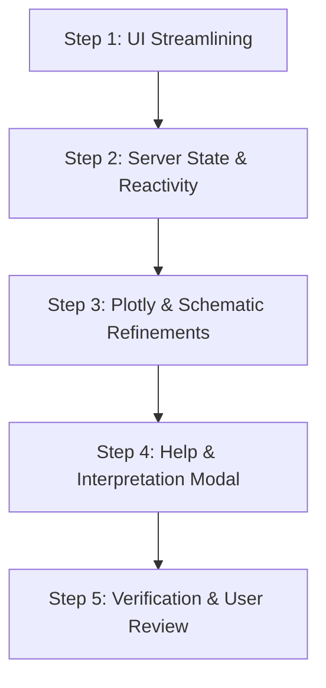

# Redesign of App

## Prompts

### Ideas to improve reactivity and navigation

* Hide "Select Chromosome:" when in "View Mode: Genome-Wide"
* "View Mode: Locus Zoom"
  * If "Search Gene Symbol:" is empty, main panel is blank.
  * Don't show "Locus Zoom" option until Gene Symbol is non-empty.
  * Once a "Gene Symbol" is selected, it appears.
  * If you then blank out "Search Gene Symbol", the last searched gene symbol is still selected.
* "Locus Window (Kbp):" this is only relevant when in "Locus Zoom"
  * Might be useful to have only selected set of values, say 20,50,100,200,500,1000,2000
* Top main panel initially has whole genome. When you "Select Gene Symbol":
  * "View Mode:" switches to "Locus Zoom"
  * X axis named as "Chromosome" with no Mbp ticks.
  * Want to be able to switch from "Locus Zoom" to "Chromosome" to the right chromosome easily.
* "Visible Categories:" is redundant given plotly ability to click on labels.
* "Min Peak Score:" consider selected values as for "Locus Window".

### Challenges with Interpreting

* Need explanation of both panels on "Locus Zoom".
  * This could be pop-up or pull-down.
  * Is top panel a subset of the "Chromosome" image?
* Reactive hiding and showing of side panel would simplify presentation
(see ideas above).

---

## Implementation Plan: MafA Discovery Shiny App Redesign

This plan addresses all items outlined in [`redesign.md`](file:///Users/brianyandell/Documents/GitHub/MafADiscovery/redesign.md) to streamline UI reactivity, simplify navigation, eliminate redundant controls, and clarify multi-panel interpretation.

### 1. Architectural Summary & Objectives

| Objective | Current Behavior | Proposed Solution |
| :--- | :--- | :--- |
| **Chromosome Selector Visibility** | Always rendered in sidebar even in *Genome-Wide* mode. | Conditionally display `sel_chr` only when in *Chromosome* view mode. |
| **"Locus Zoom" Mode Availability** | Always available in dropdown, leading to empty/confusing plots if no gene/peak is selected. | Dynamically offer `"Locus Zoom"` only after a gene is searched or peak is clicked. |
| **Search Gene Symbol Retention** | Clearing the search box can clear active selection and cause blank states. | Cache `v$last_gene` / `v$active_pk`; preserve the active locus even if the search input is momentarily cleared. |
| **Locus Window (kb) Control** | Free-form `numericInput` always visible in sidebar. | Show only during *Locus Zoom*; convert to discrete selection (`20, 50, 100, 200, 500, 1000, 2000` kb). |
| **Locus Zoom $\leftrightarrow$ Chromosome Transition** | Selecting a gene sets peak but does not update `sel_chr`, causing switching to *Chromosome* to reset to Chr1. | Sync `sel_chr` to match `v$active_pk$Chr` whenever a gene is selected or a peak is clicked. |
| **Top Panel in Locus Zoom** | 1 Mbp window with global axis label "Chromosome" and no tick marks. | Clarify coordinate scale with local Mbp ticks (`Chr X (Mbp)`), or show Chromosome context with active peak highlighted. |
| **Redundant "Visible Categories"** | Bulky `checkboxGroupInput` duplicates Plotly's native interactive legend filtering. | Remove `show_cat` from sidebar; rely on Plotly's interactive legend filtering and render all categories in schematic. |
| **Min Peak Score** | Continuous slider (`0`–`10,000`). | Convert to discrete selections (`0, 100, 200, 500, 1000, 2000, 5000`) for cleaner filtering. |
| **Interpretation & Visual Guidance** | No in-app explanation of the relationship between top and bottom panels. | Add an interactive "How to Interpret" popover/modal explaining the macro-micro relationship between panels. |

---

### 2. Detailed Technical Specifications

#### 2.1 Conditional Chromosome Selector

- Wrap the chromosome selector in a conditional UI or render conditionally:

  ```r
  output$chr_selector_ui <- renderUI({
    req(input$zoom_mode == "Chromosome")
    selectInput("sel_chr", "Select Chromosome:", choices = d$chr_map$Chr, selected = v$current_chr)
  })
  ```

- Result: Chromosome selector is automatically hidden in *Genome-Wide* and *Locus Zoom* modes.

#### 2.2 Dynamic "View Mode" Lifecycle

- Initial state:

  ```r
  zoom_choices <- c("Genome-Wide", "Chromosome")
  ```

- When a gene symbol is selected (`input$search_gene != ""`):
  * Identify target gene and closest MafA binding peak.
  * Set `v$active_pk` and `v$last_gene <- input$search_gene`.
  * Update `v$current_chr <- gene_row$Chr[1]`.
  * Expand choices: `updateSelectInput(session, "zoom_mode", choices = c("Genome-Wide", "Chromosome", "Locus Zoom"), selected = "Locus Zoom")`.
* When `input$search_gene` is blanked out:
  * Keep `v$last_gene` and `v$active_pk` active in memory; do not reset the plot to blank.
  * Retain `"Locus Zoom"` in `zoom_mode` choices as long as `v$active_pk` is non-null.
* When **↺ Reset to Genome-Wide** is clicked:
  * Reset `v$active_pk <- NULL`, `v$active_snp <- NULL`, `v$last_gene <- NULL`.
  * Reset `search_gene` to `""`.
  * Reset `zoom_mode` choices back to `c("Genome-Wide", "Chromosome")` with `selected = "Genome-Wide"`.

#### 2.3 Seamless Chromosome $\leftrightarrow$ Locus Zoom Linking

- When a gene or peak is selected on chromosome $K$:
  * Automatically update the chromosome tracking value (`v$current_chr <- pk$Chr`).
  * If the user changes `View Mode` to `"Chromosome"`, it automatically centers on chromosome $K$ rather than defaulting to `Chr1`.

---

### 3. Discrete Filter Controls

#### 3.1 Discrete Locus Window (`win_kb`)

- Conditionally render only when `input$zoom_mode == "Locus Zoom"`:

  ```r
  output$locus_window_ui <- renderUI({
    req(input$zoom_mode == "Locus Zoom")
    selectInput("win_kb", "Locus Window:", 
                choices = c("20 kb" = 20, "50 kb" = 50, "100 kb" = 100, 
                            "200 kb" = 200, "500 kb" = 500, "1,000 kb (1 Mb)" = 1000, 
                            "2,000 kb (2 Mb)" = 2000), 
                selected = 500)
  })
  ```

#### 3.2 Discrete Min Peak Score (`min_score`)

- Replace the continuous 0–10,000 slider with discrete thresholds:

  ```r
  selectInput("min_score", "Min Peak Score:",
              choices = c("All (0)" = 0, "100" = 100, "200" = 200, 
                          "500" = 500, "1,000" = 1000, "2,000" = 2000, 
                          "5,000" = 5000),
              selected = 0)
  ```

#### 3.3 Elimination of Redundant "Visible Categories"

- Remove `checkboxGroupInput("show_cat", ...)` from the sidebar.
* Users can click any category in the Plotly legend to hide/show that trace, or double-click to isolate it.
* In `schematic` rendering, include all local DEGs color-coded by category.

---

### 4. Panel Coordination & Interpretability in Locus Zoom

#### 4.1 Top Panel Coordinate Ticks in Locus Zoom

- Currently, the top panel in Locus Zoom uses whole-genome midpoint breaks, resulting in no tick marks within the 1 Mb window.
* Fix:

  ```r
  # In Locus Zoom mode: compute local Mbp ticks
  center_mbp <- v$active_pk$GlobalPos_Mbp
  local_breaks <- seq(floor(x_range[1] * 2) / 2, ceiling(x_range[2] * 2) / 2, by = 0.2)
  # Convert global Mbp back to local chromosome coordinates for clear labeling:
  chr_offset <- d$chr_map[Chr == v$active_pk$Chr, Offset_Mbp]
  local_labels <- sprintf("%.2f", local_breaks - chr_offset)
  
  p <- p + 
    scale_x_continuous(limits = x_range, breaks = local_breaks, labels = local_labels) +
    labs(x = paste(v$active_pk$Chr, "(Mbp)"))
  ```

- *Alternative Consideration*: Option to keep the top panel showing the **entire chromosome** with the active peak highlighted by a gold diamond, while the bottom panel shows the zoomed locus schematic. (We can discuss this preference with the user).

#### 4.2 In-App Interpretation Guide

- Add an info button / modal: `actionLink("show_help", "ℹ️ How to interpret panels")` in the header or sidebar.
* Modal content clarifies:
  1. **Top Panel (Manhattan Plot)**: Macro view showing MafA peak scores (ChIP/CUT&RUN intensity) on left Y-axis and coding SNP conservation (`phastCons`) on right Y-axis.
  2. **Bottom Panel (Locus Schematic)**: Micro view (`± win_kb`) showing gene bodies, transcription direction arrows (TSS), and exact positions of coding SNPs relative to the MafA binding peak.
  3. **Strain Divergence**: Peaks with high SNP counts (`variant_count`) may alter MafA binding affinity and drive strain-specific DEG patterns.

---

### 5. Step-by-Step Implementation Sequence



1. **Step 1: Update UI Components in `SHINY_APP/app.R`**:
   * Convert `win_kb` and `min_score` to clean discrete `selectInput` controls.
   * Remove redundant `checkboxGroupInput("show_cat", ...)`.
   * Wrap `sel_chr` and `win_kb` in dynamic `uiOutput` containers.
   * Add help action link.

2. **Step 2: Refine Server Observers & Reactive State**:
   * Track `v$current_chr` and `v$last_gene`.
   * Implement dynamic `zoom_mode` choice expansion (`Genome-Wide`, `Chromosome`, and `Locus Zoom`).
   * Sync chromosome selection whenever a gene is searched or peak is clicked.
   * Protect against blank states when `search_gene` is cleared.

3. **Step 3: Refine Plots**:
   * Fix X-axis breaks and labels in the top Manhattan plot when in Locus Zoom.
   * Update schematic to render without needing `input$show_cat`.

4. **Step 4: Add Interpretation Modal**:
   * Implement `observeEvent(input$show_help, ...)` with concise, illustrated explanations.

5. **Step 5: Verification**:
   * Test R syntax parsing and run Shiny app locally to verify all transitions.

---

### 6. Key Design Decisions for Confirmation

1. **Top Panel Behavior in Locus Zoom**:
   * *Option A (Default)*: Keep top panel zoomed into the local ~1 Mb window, but with proper local Mbp tick marks and chromosome label.
   * *Option B (Dual Scale)*: Keep top panel showing the entire chromosome (so users see the whole chromosome context), with the active peak highlighted, while the bottom panel shows the zoomed locus.
2. **Discrete Values**:
   * Confirm preferred steps for `Locus Window` (`20, 50, 100, 200, 500, 1000, 2000` kb) and `Min Peak Score` (`0, 100, 200, 500, 1000, 2000, 5000`).
