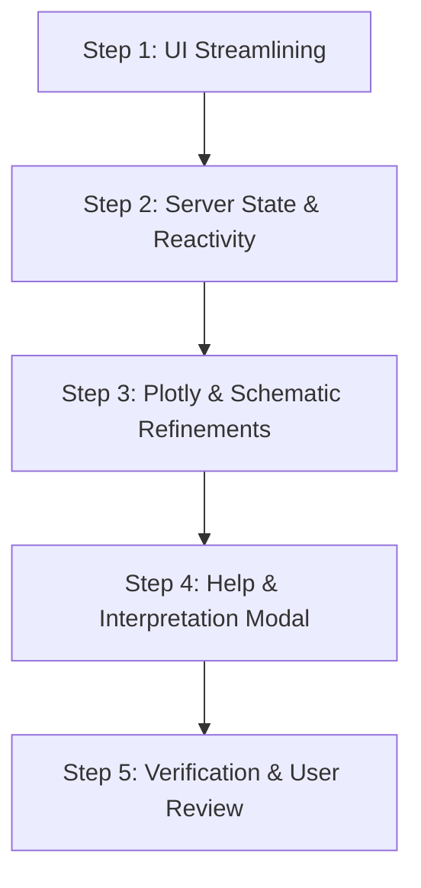
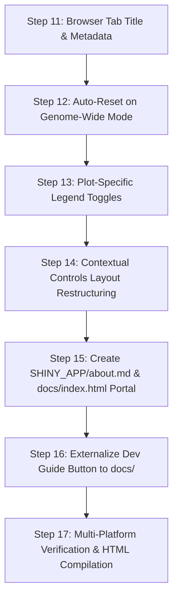

# Redesign of App

## Prompts

### Ideas to improve reactivity and navigation

* Hide "Select Chromosome:" when in "View Mode: Genome-Wide"
* "View Mode: Locus Zoom"
  * If "Search Gene Symbol:" is empty, main panel is blank.
  * Don't show "Locus Zoom" option until Gene Symbol is non-empty.
  * Once a "Gene Symbol" is selected, it appears.
  * If you then deselect "Search Gene Symbol", revert to whole genome and remove "Locus Zoom" from "View Mode".
* "Locus Window (Kbp):" this is only relevant when in "Locus Zoom"
  * Might be useful to have only selected set of values, say 20,50,100,200,500,1000,2000
* Top main panel initially has whole genome. When you "Select Gene Symbol":
  * "View Mode:" switches to "Locus Zoom"
  * X axis named as "Chromosome" with no Mbp ticks.
  * Want to be able to switch from "Locus Zoom" to "Chromosome" to the right chromosome easily.
* "Visible Categories:" is redundant given plotly ability to click on labels.
* "Min Peak Score:" consider selected values as for "Locus Window".

### Challenges with Interpreting

* Need explanation of both panels on "Locus Zoom".
  * This could be pop-up or pull-down.
  * Is top panel a subset of the "Chromosome" image?
* Reactive hiding and showing of side panel would simplify presentation
(see ideas above).

### Further Improvements

* Organize `{shinyapp,publishapp,redesign,qtlanalysis}.md` as a `Developer Guide` to be published via `docs/`.
* Fix `Reset` on app to reset everything, including selected gene.
* Move `Reset` and `Developer Guide` (new)buttons to below "Min phastCons Score:" slider.
* Detailed "Peak" information now on sidebar should go below last figure on main panel.

### More Improvements

* Change browser tab title from "Shiny App" to "MafA Discovery".
* Move controls from side panel next to plot
* Add plot-specific option(s) to hide legend
* Modify "Dev Guide" button on app to go to "<https://byandell.github.io/MafADiscovery/docs>", which would have `docs/index.html` that renders `developer_guide.md`
* Switching to "View Mode: Genome-Wide" should reset everthing.
* Add `SHINY_APP/about.md` and link from `docs/index.html`.

## Future Considerations

* Panels rather than select
* Condense redesign.md

---

## Implementation Plan: MafA Discovery Shiny App Redesign

This plan addresses all items outlined in `Prompts` section of
[`redesign.md`](redesign.md#prompts)
to streamline UI reactivity, simplify navigation, eliminate redundant controls, and clarify multi-panel interpretation.

### 1. Architectural Summary & Objectives

| Objective | Current Behavior | Proposed Solution |
| :--- | :--- | :--- |
| **Chromosome Selector Visibility** | Always rendered in sidebar even in *Genome-Wide* mode. | Conditionally display `sel_chr` only when in *Chromosome* view mode. |
| **"Locus Zoom" Mode Availability** | Always available in dropdown, leading to empty/confusing plots if no gene/peak is selected. | Dynamically offer `"Locus Zoom"` only after a gene is searched or peak is clicked. |
| **Search Gene Symbol Deselection** | Clearing the search box left "Locus Zoom" active and could retain stale selection. | Automatically revert to whole genome (`Genome-Wide`), clear active peak/SNPs, and remove `"Locus Zoom"` from `View Mode`. |
| **Locus Window (kb) Control** | Free-form `numericInput` always visible in sidebar. | Show only during *Locus Zoom*; convert to discrete selection (`20, 50, 100, 200, 500, 1000, 2000` kb). |
| **Locus Zoom $\leftrightarrow$ Chromosome Transition** | Selecting a gene sets peak but does not update `sel_chr`, causing switching to *Chromosome* to reset to Chr1. | Sync `sel_chr` to match `v$active_pk$Chr` whenever a gene is selected or a peak is clicked. |
| **Top Panel in Locus Zoom** | 1 Mbp window with global axis label "Chromosome" and no tick marks. | Clarify coordinate scale with local Mbp ticks (`Chr X (Mbp)`), or show Chromosome context with active peak highlighted. |
| **Redundant "Visible Categories"** | Bulky `checkboxGroupInput` duplicates Plotly's native interactive legend filtering. | Remove `show_cat` from sidebar; rely on Plotly's interactive legend filtering and render all categories in schematic. |
| **Min Peak Score** | Continuous slider (`0`–`10,000`). | Convert to discrete selections (`0, 100, 200, 500, 1000, 2000, 5000`) for cleaner filtering. |
| **Interpretation & Visual Guidance** | No in-app explanation of the relationship between top and bottom panels. | Add an interactive "How to Interpret" popover/modal explaining the macro-micro relationship between panels. |

---

### 2. Detailed Technical Specifications

#### 2.1 Conditional Chromosome Selector

* Wrap the chromosome selector in a conditional UI or render conditionally:

  ```r
  output$chr_selector_ui <- renderUI({
    req(input$zoom_mode == "Chromosome")
    selectInput("sel_chr", "Select Chromosome:", choices = d$chr_map$Chr, selected = v$current_chr)
  })
  ```

* Result: Chromosome selector is automatically hidden in *Genome-Wide* and *Locus Zoom* modes.

#### 2.2 Dynamic "View Mode" Lifecycle

* Initial state:

  ```r
  zoom_choices <- c("Genome-Wide", "Chromosome")
  ```

* When a gene symbol is selected (`input$search_gene != ""`):
  * Identify target gene and closest MafA binding peak.
  * Set `v$active_pk` and `v$last_gene <- input$search_gene`.
  * Update `v$current_chr <- gene_row$Chr[1]`.
  * Expand choices: `updateSelectInput(session, "zoom_mode", choices = c("Genome-Wide", "Chromosome", "Locus Zoom"), selected = "Locus Zoom")`.

* When `input$search_gene` is blanked out / deselected:
  * Revert to whole genome view (`selected = "Genome-Wide"`).
  * Remove `"Locus Zoom"` from `zoom_mode` choices (`choices = c("Genome-Wide", "Chromosome")`).
  * Reset `v$active_pk <- NULL`, `v$active_snp <- NULL`, `v$last_gene <- NULL`, `v$user_zoom <- NULL`.
  * Trigger Plotly layout revision to refresh genome-wide coordinates.
* When **↺ Reset to Genome-Wide** is clicked:
  * Reset `v$active_pk <- NULL`, `v$active_snp <- NULL`, `v$last_gene <- NULL`.
  * Reset `search_gene` to `""`.
  * Reset `zoom_mode` choices back to `c("Genome-Wide", "Chromosome")` with `selected = "Genome-Wide"`.

#### 2.3 Seamless Chromosome $\leftrightarrow$ Locus Zoom Linking

* When a gene or peak is selected on chromosome $K$:
  * Automatically update the chromosome tracking value (`v$current_chr <- pk$Chr`).
  * If the user changes `View Mode` to `"Chromosome"`, it automatically centers on chromosome $K$ rather than defaulting to `Chr1`.

---

### 3. Discrete Filter Controls

#### 3.1 Discrete Locus Window (`win_kb`)

* Conditionally render only when `input$zoom_mode == "Locus Zoom"`:

  ```r
  output$locus_window_ui <- renderUI({
    req(input$zoom_mode == "Locus Zoom")
    selectInput("win_kb", "Locus Window:", 
                choices = c("20 kb" = 20, "50 kb" = 50, "100 kb" = 100, 
                            "200 kb" = 200, "500 kb" = 500, "1,000 kb (1 Mb)" = 1000, 
                            "2,000 kb (2 Mb)" = 2000), 
                selected = 500)
  })
  ```

#### 3.2 Discrete Min Peak Score (`min_score`)

* Replace the continuous 0–10,000 slider with discrete thresholds:

  ```r
  selectInput("min_score", "Min Peak Score:",
              choices = c("All (0)" = 0, "100" = 100, "200" = 200, 
                          "500" = 500, "1,000" = 1000, "2,000" = 2000, 
                          "5,000" = 5000),
              selected = 0)
  ```

#### 3.3 Elimination of Redundant "Visible Categories"

* Remove `checkboxGroupInput("show_cat", ...)` from the sidebar.

* Users can click any category in the Plotly legend to hide/show that trace, or double-click to isolate it.
* In `schematic` rendering, include all local DEGs color-coded by category.

---

### 4. Panel Coordination & Interpretability in Locus Zoom

#### 4.1 Top Panel Coordinate Ticks in Locus Zoom

* Currently, the top panel in Locus Zoom uses whole-genome midpoint breaks, resulting in no tick marks within the 1 Mb window.

* Fix:

  ```r
  # In Locus Zoom mode: compute local Mbp ticks
  center_mbp <- v$active_pk$GlobalPos_Mbp
  local_breaks <- seq(floor(x_range[1] * 2) / 2, ceiling(x_range[2] * 2) / 2, by = 0.2)
  # Convert global Mbp back to local chromosome coordinates for clear labeling:
  chr_offset <- d$chr_map[Chr == v$active_pk$Chr, Offset_Mbp]
  local_labels <- sprintf("%.2f", local_breaks - chr_offset)
  
  p <- p + 
    scale_x_continuous(limits = x_range, breaks = local_breaks, labels = local_labels) +
    labs(x = paste(v$active_pk$Chr, "(Mbp)"))
  ```

* *Alternative Consideration*: Option to keep the top panel showing the **entire chromosome** with the active peak highlighted by a gold diamond, while the bottom panel shows the zoomed locus schematic. (We can discuss this preference with the user).

#### 4.2 In-App Interpretation Guide

* Add an info button / modal: `actionLink("show_help", "ℹ️ How to interpret panels")` in the header or sidebar.

* Modal content clarifies:
  1. **Top Panel (Manhattan Plot)**: Macro view showing MafA peak scores (ChIP/CUT&RUN intensity) on left Y-axis and coding SNP conservation (`phastCons`) on right Y-axis.
  2. **Bottom Panel (Locus Schematic)**: Micro view (`± win_kb`) showing gene bodies, transcription direction arrows (TSS), and exact positions of coding SNPs relative to the MafA binding peak.
  3. **Strain Divergence**: Peaks with high SNP counts (`variant_count`) may alter MafA binding affinity and drive strain-specific DEG patterns.

---

### 5. Step-by-Step Implementation Sequence



1. **Step 1: Update UI Components in `SHINY_APP/app.R`** (Completed):
   * Converted `win_kb` and `min_score` to clean discrete `selectInput` controls.
   * Removed redundant `checkboxGroupInput("show_cat", ...)`.
   * Wrapped `sel_chr` and `win_kb` in dynamic `uiOutput` containers.
   * Added help action button (`show_help`).

2. **Step 2: Refine Server Observers & Reactive State** (Completed):
   * Tracked `v$current_chr` and `v$last_gene`.
   * Implemented dynamic `zoom_mode` choice expansion (`Genome-Wide`, `Chromosome`, and `Locus Zoom`).
   * Synced chromosome selection whenever a gene is searched or peak is clicked.
   * Revert to whole genome (`Genome-Wide`) and remove `Locus Zoom` when `search_gene` is deselected.

3. **Step 3: Refine Plots** (Completed):
   * Fixed X-axis breaks and labels in the top Manhattan plot when in Locus Zoom mode (dynamic Mbp tick marks and chromosome labels).
   * Updated schematic to render without needing `input$show_cat`.

4. **Step 4: Add Interpretation Modal** (Completed):
   * Implemented `observeEvent(input$show_help, ...)` with concise, illustrated explanations of macro/micro panels and strain divergence.

5. **Step 5: Verification**:
   * Ready for user verification.

---

### 6. Key Design Decisions for Confirmation

1. **Top Panel Behavior in Locus Zoom**:
   * *Option A (Default)*: Keep top panel zoomed into the local ~1 Mb window, but with proper local Mbp tick marks and chromosome label.
   * *Option B (Dual Scale)*: Keep top panel showing the entire chromosome (so users see the whole chromosome context), with the active peak highlighted, while the bottom panel shows the zoomed locus.
2. **Discrete Values**:
   * Confirm preferred steps for `Locus Window` (`20, 50, 100, 200, 500, 1000, 2000` kb) and `Min Peak Score` (`0, 100, 200, 500, 1000, 2000, 5000`).

---

## 7. Implementation of Further Improvements

This section documents the technical realization of the items outlined in [Further Improvements](#further-improvements).

### Step 7: Modular Developer Guide Architecture & HTML Publication via `docs/`

To provide clear, discoverable documentation for collaborators and developers, the project's documentation was organized into five modular architecture documents rendered as styled HTML pages in `docs/` and linked through a master `DEVELOPER.md` guide:

1. **Modular Guide Structure**:
   * [`DEVELOPER.md`](DEVELOPER.md) $\to$ [`docs/DEVELOPER.html`](docs/DEVELOPER.html): Master technical guide covering repository architecture, mouse GRCm39 coordinate mapping, reactive lifecycle, coding standards, and deployment rules.
   * [`shinyapp.md`](shinyapp.md) $\to$ [`docs/shinyapp.html`](docs/shinyapp.html): Specifications and lineage for legacy prototypes (Version 1 and Version 2).
   * [`publishapp.md`](publishapp.md) $\to$ [`docs/publishapp.html`](docs/publishapp.html): Shinylive (webR) static WebAssembly deployment architecture and GitHub Actions configuration.
   * [`redesign.md`](redesign.md) $\to$ [`docs/redesign.html`](docs/redesign.html): UI modernization, reactive lifecycle, discrete filters, and panel coordination (this document).
   * [`qtlanalysis.md`](qtlanalysis.md) $\to$ [`docs/qtlanalysis.html`](docs/qtlanalysis.html): F2 glycemic QTL integration, automated confidence interval bounding, and interactive QTL reference table.

2. **Automated HTML Generation (`render_docs.R`)**:
   * Implemented [`render_docs.R`](render_docs.R) to compile all Markdown developer guides into standalone, responsive HTML pages with Inter/JetBrains typography, sticky navigation headers with a "🚀 Open App" shortcut, and GitHub-flavored table and code formatting.
   * Internal markdown document links (e.g. `(DEVELOPER.md)`) are automatically rewritten to corresponding HTML links (e.g. `(DEVELOPER.html)`).
   * Generates `docs/.nojekyll` to bypass Jekyll processing on GitHub Pages.

3. **Web Distribution via `site/` and GitHub Pages**:
   * Updated [`.github/workflows/deploy-shinylive.yaml`](.github/workflows/deploy-shinylive.yaml) to trigger on changes to root markdown guides (`*.md`) or `render_docs.R`.
   * CI installs `commonmark`, executes `Rscript render_docs.R`, and copies rendered HTML pages into `site/docs/` and `site/` alongside the exported Shinylive WebAssembly bundle.
   * Updated [`.gitignore`](.gitignore) to track `docs/*.html` and `docs/.nojekyll` while continuing to ignore heavy local Shinylive WASM binaries.

---

### Step 8: Comprehensive View & State Reset Overhaul

Previously, the reset button did not completely clear the selected gene symbol in `search_gene`, which could cause state desynchronization between the selectize input and the Manhattan view.

**Implementation in [`SHINY_APP/app.R`](SHINY_APP/app.R)**:

The `observeEvent(input$reset_view, ...)` observer was refactored into a complete state purge:

```r
observeEvent(input$reset_view, { 
  v$active_pk   <- NULL
  v$active_snp  <- NULL
  v$last_gene   <- NULL
  v$current_chr <- "Chr1"
  v$active_qtl  <- d$qtls[1]
  v$user_zoom   <- NULL
  v$reset_trigger <- v$reset_trigger + 1 
  
  # Completely clear gene search selectize (client and server side)
  updateSelectizeInput(session, "search_gene", 
                       choices = c("", sort(unique(d$genes$Symbol))), 
                       selected = "", 
                       server = TRUE)
  
  # Reset View Mode to Genome-Wide
  updateSelectInput(session, "zoom_mode", 
                    choices = c("Genome-Wide", "Chromosome", "QTL Region"), 
                    selected = "Genome-Wide")
  
  # Reset Category Checkboxes (Shared deselected by default)
  updateCheckboxGroupInput(session, "show_cat", 
                           selected = c("C57_Specific", "SJL_Specific", "Discordant"))
  
  # Reset Min Peak Score
  updateSelectInput(session, "min_score", selected = "0")
  
  # Reset Coding SNP controls
  updateCheckboxInput(session, "show_snps_main", value = TRUE)
  updateCheckboxGroupInput(session, "snp_impact", selected = c("HIGH", "MODERATE"))
  updateSliderInput(session, "min_phastcons", value = 0.7)
})
```

* **Outcome**: A single click on **↺ Reset** returns the entire app to its pristine initial state, guaranteeing that no stale gene search, zoom level, or category filter lingers.

---

### Step 9: UI Ergonomics — Repositioning Reset & Markdown-Based Modals

1. **Button Repositioning**:
   * Moved the action buttons down to sit directly below the `Min phastCons Score:` slider and horizontal divider (`hr()`).
   * Formatted side-by-side using flexbox (`display: flex; gap: 8px;`):
     * **↺ Reset** (`actionButton("reset_view", ...)`, blue primary style)
     * **📖 Dev Guide** (`actionButton("show_dev_guide", ...)`, dark charcoal utility style)

2. **Decoupled Markdown Guide Modals (`interpretation_guide.md` & `developer_guide.md`)**:
   * Extracted all modal documentation into standalone Markdown files in `SHINY_APP/` to allow direct editing without modifying R application code:
     * [`SHINY_APP/interpretation_guide.md`](SHINY_APP/interpretation_guide.md): Macro/micro panel interpretation, Manhattan axes, DEG point shapes, strain colors, coding variant impacts (`phastCons`), QTL intervals, and navigation modes.
     * [`SHINY_APP/developer_guide.md`](SHINY_APP/developer_guide.md): Architectural guide modal featuring direct links to the rendered GitHub Pages HTML documentation (`https://byandell.github.io/MafADiscovery/docs/*.html`) and GitHub source markdown files.
   * Implemented a robust dynamic path-resolution loader `render_markdown_file(filename)` in `app.R`:

     ```r
     render_markdown_file <- function(filename) {
       filepath <- if (file.exists(filename)) filename else if (file.exists(file.path("SHINY_APP", filename))) file.path("SHINY_APP", filename) else NULL
       if (!is.null(filepath)) {
         content <- paste(readLines(filepath, encoding = "UTF-8", warn = FALSE), collapse = "\n")
         div(class = "modal-markdown",
           if (exists("markdown", where = asNamespace("shiny"), mode = "function")) shiny::markdown(content)
           else if (requireNamespace("markdown", quietly = TRUE)) HTML(markdown::markdownToHTML(text = content, fragment.only = TRUE))
           else tags$pre(content)
         )
       } else {
         tags$p(paste("Documentation file not found:", filename), style = "color: red;")
       }
     }
     ```

   * Registered a local static resource path (`shiny::addResourcePath("docs", ...)`) in `app.R` so local Shiny sessions serve documentation seamlessly.
   * Added client-side modal event handling in `tags$head` so that all markdown links inside the modal automatically open in a new browser tab (`target="_blank"`, `rel="noopener noreferrer"`), preserving the user's active explorer session.

---

### Step 10: Relocation & Responsive Redesign of the Detailed Peak Information Card

1. **Motivation**:
   * The detailed peak information panel was previously squeezed into the 3-column sidebar (`width = 3`).
   * When displaying multiple local DEGs with log2 fold-changes and multi-variant coding SNP tables with `phastCons` scores, the sidebar required excessive vertical scrolling and crowded out navigation controls.

2. **Relocation to Main Panel**:
   * Moved `uiOutput("metadata_panel")` from `sidebarPanel()` to the bottom of `mainPanel()` (width = 9), placed immediately below the Locus Schematic (`plotOutput("schematic")`).

3. **Two-Column Responsive Card Architecture**:
   * Replaced the narrow single-column well with a wide, structured flexbox card:
     * **Header Bar**: Displays the peak identifier (e.g. `peak_1234`), chromosome midpoint (`Mbp`), strain-divergent variant count, and an eye-catching purple badge if the peak falls within the active F2 glycemic QTL confidence interval.
     * **Left Column (Local DEGs)**: Lists all differentially expressed genes within the locus window, color-coded by strain category (`C57_Specific`, `SJL_Specific`, `Discordant`, `Shared`), along with strain-specific log2 fold changes.
     * **Right Column (Coding SNPs)**: Groups high- and moderate-impact coding variants by gene symbol, highlighting HIGH impact counts in purple, MODERATE impact in gold, maximum `phastCons` score, and detailed amino acid substitution annotations.

---

## 8. Implementation Plan: More Improvements

This plan details the technical architecture, UI layout restructuring, reactive observers, and documentation workflows for the items outlined in [More Improvements](#more-improvements).

### 8.1 Requirements & Architectural Summary

| Objective | Current Behavior | Proposed Solution |
| :--- | :--- | :--- |
| **Browser Tab Title** | Browser displays generic "Shiny App". | Specify `fluidPage(title = "MafA Discovery: Integrated Genomic Explorer", ...)` and add `<title>MafA Discovery: Integrated Genomic Explorer</title>` with a custom SVG favicon in `tags$head`. |
| **Contextual Control Placement** | All controls are grouped in a monolithic left sidebar (`width = 3`), restricting plot width to `width = 9`. | Migrate controls out of the static sidebar into contextual toolbars adjacent to their respective visual components: global navigation (Gene search, View mode, Chromosome/QTL) above the Manhattan plot, and locus micro-controls adjacent to the Locus Schematic. |
| **Plot Legend Visibility** | Plotly legend is permanently displayed on Manhattan plot; schematic legend is fixed. | Add discrete "Hide Legend" toggles for individual plots (`hide_manhattan_legend`, `hide_schematic_legend`) to allow maximizing plotting canvas on smaller screens or uncluttering presentation. |
| **Direct Dev Guide Navigation** | "📖 Dev Guide" button opens an in-app modal reading `developer_guide.md`. | Modify "📖 Dev Guide" button to be a direct external link (`tags$a(href = "https://byandell.github.io/MafADiscovery/docs", target = "_blank", ...)`). |
| **Docs Landing Page (`docs/index.html`)** | `docs/` currently lacks an `index.html` (only individual `.html` files exist). | Update `render_docs.R` to compile `SHINY_APP/developer_guide.md` into `docs/index.html`, providing a central documentation landing portal with direct links to all modules, repository source code, and `about.html`. |
| **Genome-Wide Auto-Reset** | Selecting "Genome-Wide" in the View Mode dropdown preserves the active gene, peak, and zoom state. | Enhance `observeEvent(input$zoom_mode, ...)` so that selecting `"Genome-Wide"` automatically purges all active selections (`search_gene`, `v$active_pk`, `v$active_snp`, `v$user_zoom`, filters), returning the app to its pristine baseline. |
| **About Page Integration** | No dedicated "About" document exists in `SHINY_APP/`. | Author [`SHINY_APP/about.md`](SHINY_APP/about.md) detailing the biological background, Vanderbilt/UW collaboration, dataset provenance, and citations; compile to `docs/about.html` and link from `docs/index.html` and the global documentation header. |

---

### 8.2 Detailed Technical Specifications

#### 8.2.1 Browser Tab Title & HTML Head Metadata
* In [`SHINY_APP/app.R`](SHINY_APP/app.R):
  ```r
  ui <- fluidPage(
    title = "MafA Discovery: Integrated Genomic Explorer",
    tags$head(
      tags$title("MafA Discovery: Integrated Genomic Explorer"),
      tags$link(rel = "icon", href = "data:image/svg+xml,<svg xmlns='http://www.w3.org/2000/svg' viewBox='0 0 100 100'><text y='.9em' font-size='90'>🧬</text></svg>"),
      ...
    ),
    ...
  )
  ```
* **Outcome**: Tab in browser immediately displays "MafA Discovery: Integrated Genomic Explorer" with a genomics DNA favicon instead of generic Shiny defaults.

#### 8.2.2 Contextual Controls Layout (Adjacent to Plots)
* **Design Motivation**:
  * A fixed 3-column sidebar steals 25% of horizontal screen space, cramping genome-wide Manhattan plots where chromosome x-axes benefit from maximum width.
  * Separating global navigation controls from micro-locus controls places inputs right where the user's attention is focused.
* **Layout Structure**:
  1. **Top Global Navigation & Filter Bar** (Above Manhattan Plot):
     * **Row 1 (Primary Navigation)**:
       * Search Gene Symbol (`selectizeInput("search_gene", ...)`).
       * View Mode (`selectInput("zoom_mode", ...)`).
       * Dynamic Chromosome Selector (`uiOutput("chr_selector_ui")`) / Dynamic QTL Selector (`uiOutput("qtl_selector_ui")`).
       * Action buttons: `📊 QTLs`, `ℹ️ Guide`, `📖 Dev Guide ↗`, `↺ Reset`.
     * **Row 2 (Global Filters)**:
       * Visible Categories (`checkboxGroupInput("show_cat", ...)`).
       * Min Peak Score (`selectInput("min_score", ...)`).
  2. **Manhattan Macro Panel** (Full 12-column width):
     * Visualization: `plotlyOutput("manhattan", height = "500px")`.
     * Utility Bar: Quick toggle `checkboxInput("hide_manhattan_legend", "Hide Legend", value = FALSE)`.
  3. **Locus Schematic & Contextual Micro-Controls** (Integrated Card):
     * **Sub-Bar (Micro Controls)**: Placed immediately above or in a sidebar adjacent to the schematic:
       * Locus Window (`uiOutput("locus_window_ui")`).
       * Coding SNPs toggle (`checkboxInput("show_snps_main", ...)`).
       * SNP Impact (`checkboxGroupInput("snp_impact", ...)`).
       * Min phastCons score (`sliderInput("min_phastcons", ...)`).
       * Schematic legend toggle (`checkboxInput("hide_schematic_legend", "Hide Legend", value = FALSE)`).
     * **Plot Area**: `plotOutput("schematic", height = "350px")`.
  4. **Detailed Peak Information Card** (Full-width responsive 2-column card as established in Step 10).

#### 8.2.3 Plot-Specific Legend Toggles
* **Manhattan Plot Legend**:
  * Control: `checkboxInput("hide_manhattan_legend", "Hide Legend", value = FALSE)`.
  * Plotly binding in `server`:
    ```r
    p <- ggplotly(p, tooltip = "text", source = "manhattan") %>%
      layout(
        showlegend = !isTRUE(input$hide_manhattan_legend),
        legend = list(orientation = "h", x = 0.5, xanchor = "center", y = -0.15)
      )
    ```
* **Locus Schematic Legend**:
  * Control: `checkboxInput("hide_schematic_legend", "Hide Legend", value = FALSE)`.
  * ggplot binding in `output$schematic`:
    ```r
    if (isTRUE(input$hide_schematic_legend)) {
      p_schem <- p_schem + theme(legend.position = "none")
    }
    ```

#### 8.2.4 "Dev Guide" Redirection to `docs/` Landing Page
* In `ui`: Replace `actionButton("show_dev_guide", ...)` with an external anchor button:
  ```r
  tags$a(
    href = "https://byandell.github.io/MafADiscovery/docs",
    target = "_blank",
    rel = "noopener noreferrer",
    class = "btn btn-devguide",
    style = "text-decoration: none; display: inline-flex; align-items: center; justify-content: center; font-weight: bold;",
    "📖 Dev Guide ↗"
  )
  ```
* In [`render_docs.R`](render_docs.R):
  * Update generator to compile `SHINY_APP/developer_guide.md` into `docs/index.html`.
  * Ensures `https://byandell.github.io/MafADiscovery/docs` renders a complete portal with links to all architectural guides, the app, and `about.html`.

#### 8.2.5 Auto-Resetting State on "View Mode: Genome-Wide" Selection
* In `server` of [`SHINY_APP/app.R`](SHINY_APP/app.R):
  * Refactor reset routine into a centralized helper function:
    ```r
    reset_to_default_state <- function() {
      v$active_pk   <- NULL
      v$active_snp  <- NULL
      v$last_gene   <- NULL
      v$current_chr <- "Chr1"
      v$active_qtl  <- d$qtls[1]
      v$user_zoom   <- NULL
      v$reset_trigger <- v$reset_trigger + 1
      
      updateSelectizeInput(session, "search_gene", choices = c("", sort(unique(d$genes$Symbol))), selected = "", server = TRUE)
      updateCheckboxGroupInput(session, "show_cat", selected = c("C57_Specific", "SJL_Specific", "Discordant"))
      updateSelectInput(session, "min_score", selected = "0")
      updateCheckboxInput(session, "show_snps_main", value = TRUE)
      updateCheckboxGroupInput(session, "snp_impact", selected = c("HIGH", "MODERATE"))
      updateSliderInput(session, "min_phastcons", value = 0.7)
    }
    ```
  * In the observer for `input$zoom_mode`:
    ```r
    observeEvent(input$zoom_mode, {
      if (input$zoom_mode == "Genome-Wide") {
        if (!is.null(v$active_pk) || !is.null(v$last_gene) || nzchar(input$search_gene)) {
          reset_to_default_state()
        }
      }
    })
    ```
  * Both the **↺ Reset** button and selecting `"Genome-Wide"` in the dropdown will now call `reset_to_default_state()`.

#### 8.2.6 Creation of `SHINY_APP/about.md` & Docs Integration
* Author [`SHINY_APP/about.md`](SHINY_APP/about.md) with:
  * **Biological Context**: MafA transcription factor binding dynamics, strain divergence between C57BL/6J and SJL/J, and type 2 diabetes etiology.
  * **Research Consortium**: Collaborative investigation between Vanderbilt University Medical Center (Roland Stein Laboratory) and the University of Wisconsin-Madison (Departments of Statistics, Biochemistry, and Nutritional Sciences: Brian Yandell, Mark Keller, Alan Attie).
  * **Integrated Data Assets**:
    * MafA ChIP-seq / CUT&RUN binding peak intervals and strength scores.
    * Strain-divergent sequence polymorphisms (SNPs & indels).
    * B6 vs. SJL differential gene expression (DEGs) across islet perturbation models.
    * High/moderate impact coding sequence variants annotated with `phastCons` conservation scores.
    * B6 $\times$ SJL F2 intercross glycemic QTL loci with 95% confidence intervals and additive effect models.
  * **Citation & Funding**: Grant support and publication references.
* In [`render_docs.R`](render_docs.R):
  * Add `"SHINY_APP/about.md" = "About MafA Discovery — Context & Collaborators"` to `files_to_render`.
  * Compile to `docs/about.html`.
  * Add `About` link to the sticky top navigation header in all rendered HTML pages:
    ```html
    <li><a href="about.html">About</a></li>
    ```

---

### 8.3 Step-by-Step Implementation Sequence



1. **Step 11: Update Browser Tab Title & Head Metadata** (Completed):
   * Added `title = "MafA Discovery: Integrated Genomic Explorer"` in `fluidPage()`.
   * Added `<title>` and inline genomics SVG favicon (`🧬`) in `tags$head`.

2. **Step 12: Wire Auto-Reset on "Genome-Wide" View Mode** (Completed):
   * Centralized `reset_to_default_state()` in `server` to purge `v$active_pk`, `v$active_snp`, `v$last_gene`, `search_gene`, and restore default filters and choices.
   * Linked `observeEvent(input$zoom_mode, ...)` to trigger `reset_to_default_state()` whenever `"Genome-Wide"` is selected.

3. **Step 13: Implement Plot-Specific Legend Toggles** (Completed):
   * Added `hide_manhattan_legend` checkbox input; wired into Plotly `layout(showlegend = !isTRUE(input$hide_manhattan_legend))`.
   * Added `hide_schematic_legend` checkbox input; wired into ggplot `theme(legend.position = if (isTRUE(input$hide_schematic_legend)) "none" else "right")`.

4. **Step 14: Contextual Plot Controls Layout Restructuring** (Completed):
   * Reorganized UI from monolithic 3-column sidebar into:
     * Top Global Navigation Bar (`well-nav`): Title brand, `search_gene`, `zoom_mode`, dynamic chromosome/QTL selector (`context_selector_ui`), and quick action buttons (`📊 QTLs`, `ℹ️ Guide`, `📖 Dev Guide ↗`, `↺ Reset`).
     * Manhattan Row: 9-column Plotly canvas + 3-column contextual control panel (`well-ctrl`) for legend toggle, peak categories, min peak score, and coding SNP filters.
     * Locus Schematic Row: 9-column ggplot canvas + 3-column contextual control panel (`well-ctrl`) for legend toggle, locus window size (`win_kb`), and micro-architecture guide.
     * Peak Metadata Row: Full 12-column responsive two-column card.

5. **Step 15: Author `SHINY_APP/about.md` & Update `render_docs.R`** (Completed):
   * Created [`SHINY_APP/about.md`](SHINY_APP/about.md) with consortium, biological, and dataset details.
   * Updated [`render_docs.R`](render_docs.R) to compile `docs/index.html` (from `developer_guide.md`) and `docs/about.html`.
   * Added "About" and "Documentation Hub" to the global HTML navigation header.

6. **Step 16: Externalize "Dev Guide" Button with Shinylive-Aware Dynamic URL Resolution** (Completed):
   * Converted button in `SHINY_APP/app.R` to use client-side `resolveDocsUrl()` and clean relative link `docs` (`target="_blank"`).
   * **Shinylive Sandboxed Path Handling**: When running on GitHub Pages, Shinylive executes within an embedded iframe under a virtual sub-path (e.g. `/MafADiscovery/app_eeyp6ad5eaxg6eqqlyd9/`). Standard relative links resolve into that virtual folder, producing garbled 404 links like `.../app_xxxx/docs`. `resolveDocsUrl()` intercepts the click, dynamically strips the virtual `/app_[^/]+/` segment, and rewrites the target to clean URL `https://byandell.github.io/MafADiscovery/docs`.
   * **Local RStudio Sessions**: When running on `localhost` / `127.0.0.1`, `resolveDocsUrl()` keeps the local clean path `docs`, which Shiny resolves from disk via `shiny::addResourcePath("docs", ...)`.

7. **Step 17: Search Gene Purge on QTL Region Selection & Reactive Guards** (Completed):
   * Selecting *"QTL Region"* in `zoom_mode` automatically clears `search_gene` and purges `v$last_gene`.
   * Selecting a QTL from `sel_qtl` or jumping from the interactive reference table modal (`jump_qtl_btn`) also clears `search_gene`.
   * Hardened `observeEvent(input$search_gene)` with reactive guards so that clearing the search box while inspecting a QTL or chromosome does not trigger an unintended bounce back to *Genome-Wide* view.

8. **Step 18: Deployment Workflow Protection & Multi-Platform Documentation Compilation** (Completed):
   * Updated `.github/workflows/deploy-shinylive.yaml` so that `docs/index.html` is placed into `site/docs/index.html` without overwriting `site/index.html` (the Shinylive WebAssembly application).
   * Executed `Rscript render_docs.R` to compile all Markdown files into standalone HTML pages (`docs/index.html`, `docs/about.html`, `docs/DEVELOPER.html`, `docs/redesign.html`, `docs/qtlanalysis.html`, `docs/publishapp.html`, `docs/shinyapp.html`).
   * Validated local Shiny application parsing via `Rscript -e "parse('SHINY_APP/app.R')"`.

9. **Step 19: Smart Return-to-App Navigation from Documentation Pages** (Completed):
   * Configured the **"📖 Dev Guide ↗"** button in `SHINY_APP/app.R` with `rel="opener"` so the newly opened documentation tab retains access to `window.opener`.
   * Added `handleOpenApp(event)` in `render_docs.R` across all rendered HTML documentation pages. When the user clicks **"🚀 Open App"** (or the brand title in the documentation header), the script checks if `window.opener` exists and is still open; if so, it brings the original Shiny app tab back into focus (`window.opener.focus()`) and closes the docs tab (`window.close()`), returning directly to the active session without re-executing or resetting the Shiny app.
   * If the docs page was opened standalone (e.g. via direct URL or bookmark without an opener), the link behaves as a clean hyperlink navigating to `../` (`https://byandell.github.io/MafADiscovery`).

10. **Step 20: Shinylive WebAssembly HTML Shell Browser Title Customization** (Completed):
    * Standard Shiny UI title definitions (`titlePanel()`, `fluidPage(title = ...)`) only affect the internal DOM; when deployed via Shinylive, the outer wrapper HTML (`site/index.html`) generated by `shinylive::export` defaults to `<title>Shiny App</title>`.
    * Updated `.github/workflows/deploy-shinylive.yaml` to pass `template_params = list(title = "MafA Discovery: Integrated Genomic Explorer", include_in_head = ...)` to `shinylive::export()`, ensuring the generated outer HTML shell embeds the project title and SVG DNA favicon directly in the page header.
    * Added client-side `document.title = 'MafA Discovery: Integrated Genomic Explorer';` in `SHINY_APP/app.R` and a post-export `sed` replacement safeguard in CI.

11. **Step 21: Mobile (iPhone) Responsiveness & Peak Deselection Placement** (Completed):
    * **Mobile Device Responsiveness**:
      * Added explicit `<meta name="viewport" content="width=device-width, initial-scale=1.0">` to guarantee proper mobile device rendering without artificial page downscaling.
      * Constrained document root (`html, body { max-width: 100vw; overflow-x: hidden; -webkit-text-size-adjust: 100%; }`) and grid containers (`.container-fluid`) to completely prevent horizontal overflow blowouts.
      * Configured Plotly with `responsive = TRUE` and capped CSS containers (`.plotly, .plot-container, .js-plotly-plot, .svg-container { max-width: 100% !important; }`).
      * Added `@media (max-width: 768px)` media queries optimizing plot heights (Manhattan: 380px, Schematic: 280px), reducing padding on cards and navigation bars, and stacking navigation buttons (`.top-nav-buttons`).
      * Wrapped QTL overview tables in `.table-responsive-container` (`overflow-x: auto; -webkit-overflow-scrolling: touch;`).
      * Restructured `metadata_panel` using responsive classes (`.meta-header-row`, `.meta-stats-row`, `.meta-details-row`, `.meta-details-left`, `.meta-details-right`) with mobile column-stacking and `word-break: break-all;` on detailed coding SNP entries to eliminate viewport distortion.
    * **Default Legend Hiding on Mobile**:
      * Implemented client-side detection (`isMobileClient()`) that checks viewport width ($\le 768$px) and touch/mobile user agents.
      * On mobile device load, automatically sets `hide_manhattan_legend = TRUE` and `hide_schematic_legend = TRUE` by default, maximizing precious screen real estate for the genomic plots rather than squishing them with wide legend keys.
      * Synchronized with server-side `observeEvent(input$client_is_mobile, ...)` and updated `reset_to_default_state()` so resetting the view on mobile preserves the mobile-friendly legend defaults.
    * **Peak Deselection & Conditional Locus Plot Display**:
      * **Placement in Manhattan Controls**: Placed `uiOutput("manhattan_peak_reset_ui")` directly in the **Manhattan Controls** side panel below **"Hide Legend"**, aligning with where peak selection occurs and keeping the locus plot clean without unnecessary headers or redundant labels.
      * **Conditional Locus Visibility**: Enclosed both the Locus Micro-Architecture plot and the Locus Schematic Controls within `conditionalPanel(condition = "output.has_active_peak")` (backed by server-side `outputOptions(output, "has_active_peak", suspendWhenHidden = FALSE)`). When no peak is selected, the locus schematic and its controls do not appear, preserving a streamlined genome-wide or chromosome-level view.
      * **Seamless Re-Selection of Deselected Peaks**: Fixed a common Plotly/Shiny caching bug where re-clicking the same peak after deselecting resulted in no response. Attached a custom Plotly click handler (`setupManhattanClick`) that transmits each point click with a unique timestamp and `{priority: 'event'}` to `input$manhattan_click_custom`, guaranteeing that clicking the exact same peak immediately re-selects it and reopens the locus schematic without requiring a different point click first.


