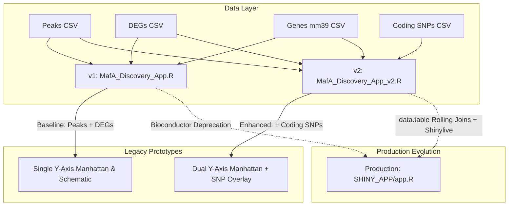
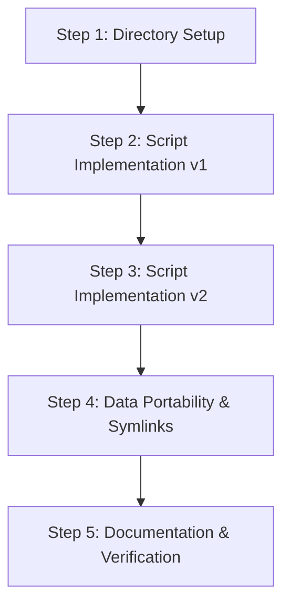

# Legacy MafA Explorer Applications (v1 & v2)

## Prompts

### Objective
Create, document, and preserve the standalone prototype applications in `SHINY_APP_LEGACY/MafA*.R`, providing a complete technical implementation plan and record for both **Version 1** (`MafA_Discovery_App.R`) and **Version 2** (`MafA_Discovery_App_v2.R`).

### Prompt Requirements
1. **Version 1 (`MafA_Discovery_App.R`)**:
   - Create a lightweight baseline prototype focused strictly on MafA transcription factor binding peaks and differential gene expression (DEGs).
   - Ingest 3 core datasets: peak intervals with variant counts, strain DEG comparisons, and mouse GRCm39 gene coordinates.
   - Utilize Bioconductor `GenomicRanges` for genomic interval proximity searches.
   - Deliver an interactive Manhattan plot and a locus schematic illustrating gene bodies and transcription orientation.
2. **Version 2 (`MafA_Discovery_App_v2.R`)**:
   - Extend the baseline prototype by integrating strain-divergent protein-coding SNPs between C57BL/6J and SJL/J.
   - Ingest a 4th dataset: prioritized coding SNPs with evolutionary conservation (`phastCons`) scores.
   - Implement dual Y-axis scaling on the Manhattan plot (left axis: MafA peak score; right secondary axis: `phastCons` score).
   - Enable bidirectional interactive clicking: clicking a peak highlights it, while clicking a coding SNP highlights the variant diamond and automatically selects the nearest MafA peak.
   - Render coding variants directly onto gene models in the locus schematic (hollow diamonds for $\text{pCons} < 0.7$, solid diamonds for $\ge 0.7$).
   - Expand the sidebar metadata card with coding variant consequences, amino acid changes, and impact ratings.
3. **Legacy Preservation & Standalone Execution**:
   - House these legacy scripts in `SHINY_APP_LEGACY/` as self-contained prototypes.
   - Maintain full documentation in [`SHINY_APP_LEGACY/README.md`](SHINY_APP_LEGACY/README.md).
   - Provide a clear migration path to the production application in [`SHINY_APP/app.R`](SHINY_APP/app.R).

---

## Implementation Plan: Creating and Preserving `SHINY_APP_LEGACY/MafA*.R`

---

### 1. Comparative Architecture: Version 1 vs. Version 2

| Feature / Dimension | Version 1 (`MafA_Discovery_App.R`) | Version 2 (`MafA_Discovery_App_v2.R`) |
| :--- | :--- | :--- |
| **Script Path** | [`SHINY_APP_LEGACY/MafA_Discovery_App.R`](SHINY_APP_LEGACY/MafA_Discovery_App.R) | [`SHINY_APP_LEGACY/MafA_Discovery_App_v2.R`](SHINY_APP_LEGACY/MafA_Discovery_App_v2.R) |
| **Data Ingestion** | 3 CSVs (~6.3 MB) | 4 CSVs (~15.4 MB, adds prioritized coding SNPs) |
| **Genomic Distance Engine** | Bioconductor `GenomicRanges::nearest()` & `findOverlaps()` | Bioconductor `GenomicRanges::nearest()` & `findOverlaps()` |
| **Default Locus Window** | 250 kb | 500 kb |
| **Coding SNP Controls** | *None* | Checkboxes for SNP overlay, Impact filter (`HIGH`/`MODERATE`), `min_phastcons` slider |
| **Manhattan Y-Axis** | Single primary Y-axis: MafA Peak Score (0–10,000) | **Dual Y-Axis**: Primary Y-axis = Peak Score; Secondary Y-axis = `phastCons` score (0–1) |
| **Manhattan Plot Glyphs** | MafA peak points only (color by Category, shape by Direction) | MafA peaks **plus** coding SNPs plotted as diamonds (`shape = 23`) color-coded by impact |
| **Interactivity** | Single-entity: Click peak only | **Bidirectional**: Click peak $\rightarrow$ view locus; Click SNP $\rightarrow$ highlight variant and select nearest peak |
| **Locus Schematic** | Gene bodies, TSS arrows, and peak highlight interval | Gene models with **coding SNPs plotted directly on gene tracks** with differential conservation styling |
| **Sidebar Metadata** | Peak coordinates, SNP count, local DEGs with $\log_2\text{FC}$ | Local DEGs **plus** detailed **Coding SNPs card** with position, consequence (`csq`), AA change, and `phastCons` |

---

### 2. Version 1 Technical Specification (`MafA_Discovery_App.R`)

#### 2.1 Data Ingestion (`prepare_data()`)
- Ingests 3 CSV datasets:
  - `MafA_Peaks_with_SNPs_v3.csv`
  - `Master_DEG_Strain_Comparison_v3.csv`
  - `mouse_genes_mm39_v3.csv`
- Sets up standard GRCm39 chromosome lengths and linear Manhattan coordinates (`GlobalPos_Mbp`).

#### 2.2 UI Structure
- Sidebar (width = 3):
  - ↺ Reset to Genome-Wide button.
  - Gene Symbol autocomplete (`selectizeInput("search_gene", ...)`).
  - View Mode dropdown (`Genome-Wide`, `Chromosome`, `Locus Zoom`).
  - Chromosome selector (`selectInput("sel_chr", ...)`).
  - Category filter (`show_cat`: Shared, C57_Specific, SJL_Specific, Discordant).
  - Locus window input (`numericInput("win_kb", value = 250)`).
  - Min peak score slider (`sliderInput("min_score", 0, 10000, 0)`).
  - Dynamic metadata panel (`uiOutput("metadata_panel")`).
- Main Panel (width = 9):
  - Plotly Manhattan plot (`plotlyOutput("manhattan", height = "500px")`).
  - Locus schematic (`plotOutput("schematic", height = "350px")`).

#### 2.3 Server Logic
- Reactive state: `active_pk`, `reset_trigger`, `user_zoom`.
- Peak-to-DEG mapping: Converts peaks and DEGs to `GRanges` objects and uses `GenomicRanges::distanceToNearest()` or `findOverlaps()`.
- Schematic: Computes multi-track gene body layout avoiding overlaps, renders TSS orientation arrows, and highlights peak interval.

---

### 3. Version 2 Technical Specification (`MafA_Discovery_App_v2.R`)

#### 3.1 Extended Data Ingestion
- Ingests all 3 v1 CSV datasets plus:
  - `B6_SJL_prioritized_protein_coding_SNPs.csv`
- Formats SNP coordinates (`Chr`, `pos`), ensures numeric `phastCons_score`, and classifies impacts (`HIGH` vs `MODERATE`).
- Calculates linear Manhattan position for all SNPs: `snps[chr_map, on = "Chr", GlobalPos_Mbp := (pos / 1e6) + i.Offset_Mbp]`.

#### 3.2 Enhanced UI Controls
- Adds coding variant controls in the sidebar:
  - `checkboxInput("show_snps_main", "Show Coding SNPs on Main Plot", value = TRUE)`
  - `checkboxGroupInput("snp_impact", "Coding SNP Impact:", choices = c("HIGH", "MODERATE"), selected = c("HIGH", "MODERATE"))`
  - `sliderInput("min_phastcons", "Min phastCons Score:", min = 0, max = 1, value = 0.7, step = 0.05)`

#### 3.3 Dual-Axis Manhattan Plot & Bidirectional Clicking
- Secondary Y-axis scaling: Scales `phastCons_score` to `y_max` of peak scores using `ggplot2::sec_axis(~ . / y_max, name = "phastCons Conservation Score (0-1)")`.
- Visual overlay: Coding SNPs rendered as diamonds (`shape = 23`), sized and colored by impact (`#CC00CC` for HIGH, `#DAA520` for MODERATE).
- Plotly click handler:
  - Checks if a peak was clicked $\rightarrow$ sets `v$active_pk`.
  - Checks if a coding SNP was clicked $\rightarrow$ sets `v$active_snp` and snaps `v$active_pk` to the nearest peak on that chromosome.

#### 3.4 Variant-Aware Locus Schematic
- Maps coding SNPs onto gene bodies within `± win_kb`.
- Differentiates conservation:
  - `phastCons < 0.7`: Hollow diamonds (`shape = 5`, colored by impact).
  - `phastCons >= 0.7`: Solid filled diamonds (`shape = 23`, black stroke).

#### 3.5 Extended Metadata Card
- Groups local coding SNPs by gene.
- Summarizes counts of HIGH and MODERATE impact variants.
- Lists exact base position, consequence (`csq`), amino acid change (`aa_change`), and `phastCons` score.

---

### 4. Step-by-Step Implementation Sequence

1. **Step 1: Directory Structure Setup**:
   - Establish `SHINY_APP_LEGACY/` in the repository root.
2. **Step 2: Implement `MafA_Discovery_App.R` (v1 Baseline)**:
   - Construct complete standalone script with 3-file data engine, `GenomicRanges` integration, single Y-axis Manhattan plot, and locus schematic.
3. **Step 3: Implement `MafA_Discovery_App_v2.R` (v2 Enhanced)**:
   - Construct complete standalone script incorporating the 4th CSV (`B6_SJL_prioritized_protein_coding_SNPs.csv`), dual Y-axis scaling, bidirectional Plotly click reactivity, and coding SNP schematic tracks.
4. **Step 4: Data Portability & Symlinks**:
   - Ensure both scripts use relative local CSV file paths (`fread("...")`).
   - Allow execution either by copying CSVs from `SHINY_APP/` or by creating relative symlinks.
5. **Step 5: Documentation & Archival**:
   - Maintain comprehensive documentation in [`SHINY_APP_LEGACY/README.md`](SHINY_APP_LEGACY/README.md).
   - Document differences, dependencies, and execution instructions.

---

### 5. Architectural Lineage: Legacy to Production

| Component | Legacy v1 (`MafA_Discovery_App.R`) | Legacy v2 (`MafA_Discovery_App_v2.R`) | Production (`SHINY_APP/app.R`) |
| :--- | :--- | :--- | :--- |
| **Bioconductor Dependency** | Required (`GenomicRanges`) | Required (`GenomicRanges`) | **Removed** (pure `data.table` rolling join) |
| **WebAssembly / Shinylive** | Incompatible (heavy C binaries) | Incompatible (heavy C binaries) | **100% Compatible** (zero runtime compilation) |
| **F2 Glycemic QTL Integration** | Absent | Absent | **Integrated** (`Top_glycemic_QTL_for_sex_additive_analysis.csv`) |
| **Navigation Modes** | 3 modes | 3 modes | **4 modes** (adds `QTL Region` auto-zoom) |
| **Filter Controls** | Continuous sliders | Continuous sliders | **Discrete selects** (clean intervals for window & score) |
| **Category Default** | All visible | All visible | **"Shared" deselected by default** (highlights strain differences) |
| **Interpretation Guide** | None | None | **Built-in Modal** (macro/micro panel guide + QTL table) |
